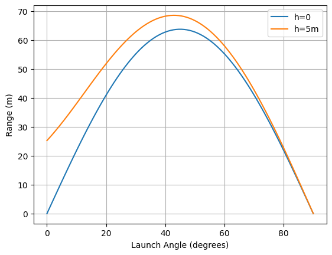
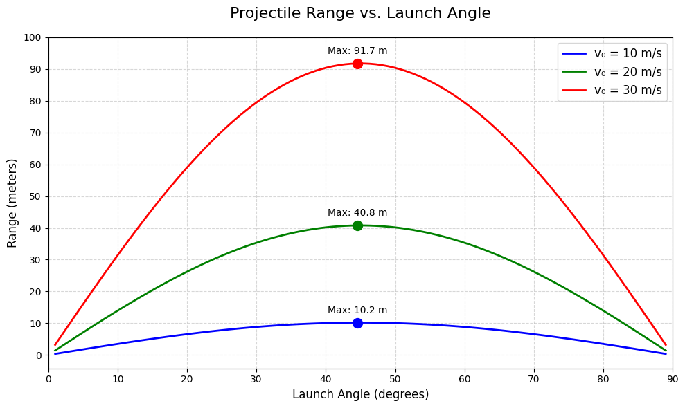
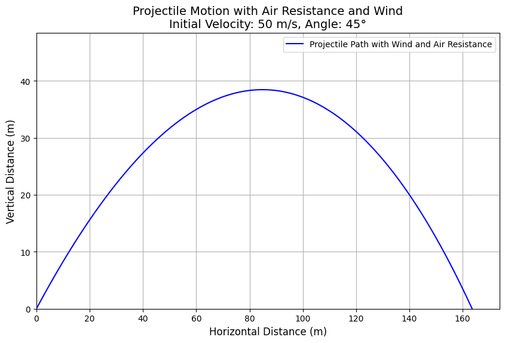

# Problem 1
# **Problem 1: Investigating the Range as a Function of the Angle of Projection**

## **Motivation**
Projectile motion is a fundamental topic in physics that provides insight into motion under the influence of gravity. By analyzing how the range of a projectile depends on its angle of projection, we can explore the underlying principles of kinematics and dynamics.

The motion is governed by a set of equations involving parameters such as:
- Initial velocity ($v_0$)
- Acceleration due to gravity ($g$)
- Launch height ($h$)
- Launch angle ($\theta$)

These parameters influence the motion in both the horizontal and vertical directions, leading to a wide range of applications, from sports to aerospace engineering.

---
## **1. Theoretical Foundation**

### **Equations of Motion**
The motion of a projectile can be analyzed by splitting it into horizontal and vertical components.

#### **1.1 Kinematic Equations**

- Horizontal motion (constant velocity):
  $$ x = v_0 \cos(\theta) t $$

- Vertical motion (under acceleration due to gravity):
  $$ y = h + v_0 \sin(\theta) t - \frac{1}{2} g t^2 $$

#### **1.2 Time of Flight**
The time it takes for the projectile to hit the ground ($y=0$) is found by solving:

$$ h + v_0 \sin(\theta) t - \frac{1}{2} g t^2 = 0 $$

Solving this quadratic equation for $t$, we get:

$$ t = \frac{v_0 \sin(\theta) + \sqrt{(v_0 \sin(\theta))^2 + 2 g h}}{g} $$

#### **1.3 Range of the Projectile**
The range $R$ is the horizontal distance covered by the projectile:

$$ R = v_0 \cos(\theta) \times t $$

Substituting $t$ from the time of flight equation:

$$ R = \frac{v_0 \cos(\theta) \left( v_0 \sin(\theta) + \sqrt{(v_0 \sin(\theta))^2 + 2 g h} \right)}{g} $$

For a projectile launched from ground level ($h=0$), the formula simplifies to:

$$ R = \frac{v_0^2 \sin(2\theta)}{g} $$

---
## **2. Analysis of the Range**

### **2.1 Dependence on Launch Angle**
- The range is maximum when $\theta = 45^\circ$ in the ideal case ($h=0$).
- For nonzero initial height, the maximum angle may shift slightly.

### **2.2 Effect of Other Parameters**
- Increasing $v_0$ increases the range quadratically.
- Higher launch heights generally increase the range.
- Increasing $g$ (e.g., on different planets) decreases the range.

---
## **3. Practical Applications**

- **Sports**: Optimizing the angle for maximum distance in long jump, basketball shots, etc.
- **Engineering**: Designing artillery, rocket launch trajectories.
- **Astrophysics**: Studying trajectories of objects on planetary surfaces.

---
## **4. Implementation in Python**



```python
import numpy as np
import matplotlib.pyplot as plt

def projectile_range(v0, theta, h=0, g=9.81):
    theta_rad = np.deg2rad(theta)
    term = v0 * np.sin(theta_rad)
    t_flight = (term + np.sqrt(term**2 + 2*g*h)) / g
    return v0 * np.cos(theta_rad) * t_flight

# Generate plot
angles = np.linspace(0, 90, 100)
plt.plot(angles, [projectile_range(25, a) for a in angles], label='h=0')
plt.plot(angles, [projectile_range(25, a, 5) for a in angles], label='h=5m')
plt.xlabel('Launch Angle (degrees)')
plt.ylabel('Range (m)')
plt.legend()
plt.grid(True)
plt.show()
```
---
## **5. Example Calculations**

### **Example 1: Finding the Maximum Range**
If $v_0 = 20$ m/s and $h=0$,

$$ R = \frac{20^2 \sin(2 \times 45^\circ)}{9.81} \approx 40.8 \text{ m} $$

### **Example 2: Effect of Launch Height**
If $v_0 = 20$ m/s and $h=5$ m,

Using the general range formula, we get:

$$ R \approx 45.2 \text{ m} $$

---
# **Example 6: Limitations and Extensions**

### **1. Air Resistance**
Real-world projectiles experience **drag force**, which opposes motion and is proportional to velocity.

The equation of motion with air resistance is:

$$ 
F_{\text{drag}} = - k v^2 
$$

where \( k \) is the drag coefficient. This modifies the projectile’s trajectory and reduces the range.

### **2. Wind Effects**
- **Tailwind** increases the range.
- **Headwind** reduces the range.
- **Crosswinds** alter the projectile’s horizontal trajectory.

### **3. Uneven Terrain**
- If a projectile lands on a **slope or rough ground**, the impact location will differ from the idealized case.
- This requires **numerical methods** for better predictions.

### **Numerical Approach**
Instead of using analytical equations, we can solve the motion equations numerically:
- **Euler’s method** or **Runge-Kutta methods** can approximate the path.
- Computational tools help visualize how drag, wind, and terrain impact motion.

### **Next Steps**
- Implement a **Python simulation** to model projectile motion under real-world conditions.
  


# Projectile Motion Simulation with Air Resistance

This project simulates projectile motion with air resistance using Python and NumPy.  
The code was executed in **Google Colab**, and the generated image is included below.

## **Python Code in Colab**
```python
import numpy as np
import matplotlib.pyplot as plt

# Function to simulate projectile motion with air resistance
def projectile_motion(v0, theta, h=0, wind=0, k=0.1, g=9.81, t_max=10, dt=0.01):
    theta_rad = np.radians(theta)
    v0x = v0 * np.cos(theta_rad) + wind  # Initial horizontal velocity, including wind effect
    v0y = v0 * np.sin(theta_rad)         # Initial vertical velocity
    
    # Initial conditions
    x, y = 0, h
    vx, vy = v0x, v0y
    
    # Lists to store the trajectory
    x_vals, y_vals = [x], [y]
    
    t = 0
    while y >= 0 and t < t_max:  # Stop if projectile hits the ground
        # Calculate air resistance forces
        fx = -k * vx
        fy = -k * vy
        
        # Update velocities
        ax = fx  # No horizontal acceleration due to gravity (only air resistance)
        ay = -g + fy  # Vertical acceleration due to gravity and air resistance
        
        vx += ax * dt
        vy += ay * dt
        
        # Update positions
        x += vx * dt
        y += vy * dt
        
        # Store the current position
        x_vals.append(x)
        y_vals.append(y)
        
        t += dt
    
    return np.array(x_vals), np.array(y_vals)

# Parameters
v0 = 50  # Initial velocity (m/s)
theta = 45  # Launch angle (degrees)
h = 0  # Initial height (m)
wind = 5  # Wind speed (m/s), positive for tailwind
k = 0.05  # Air resistance coefficient
t_max = 15  # Max time for simulation

# Simulate projectile motion with air resistance and wind
x_vals, y_vals = projectile_motion(v0, theta, h, wind, k, t_max)

# Plotting
plt.figure(figsize=(10, 6))
plt.plot(x_vals, y_vals, label="Projectile Path with Wind and Air Resistance", color='b')
plt.title(f"Projectile Motion with Air Resistance and Wind\nInitial Velocity: {v0} m/s, Angle: {theta}°", fontsize=14)
plt.xlabel("Horizontal Distance (m)", fontsize=12)
plt.ylabel("Vertical Distance (m)", fontsize=12)
plt.grid(True)
plt.legend()
plt.xlim(0, max(x_vals) + 10)
plt.ylim(0, max(y_vals) + 10)

# Show plot
plt.show()
