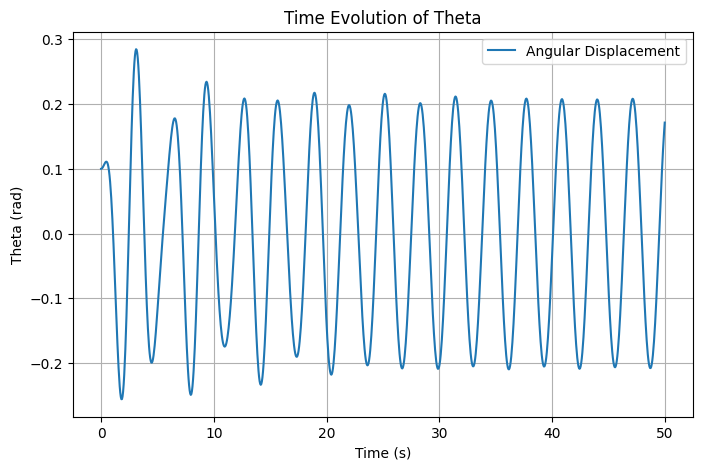
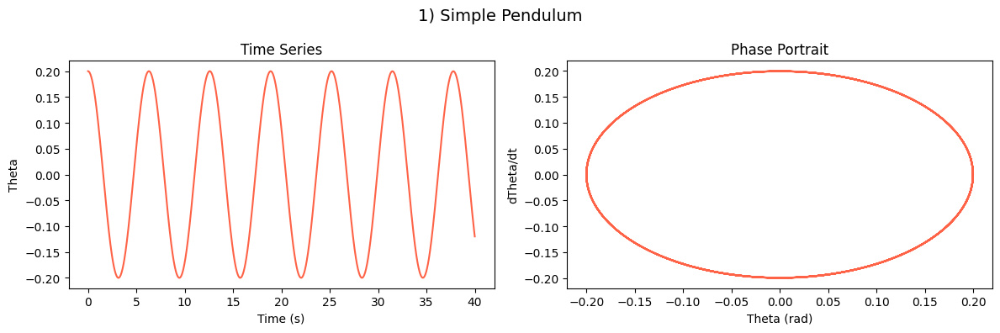
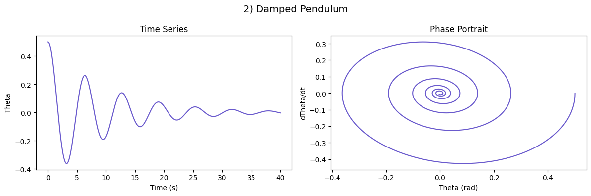
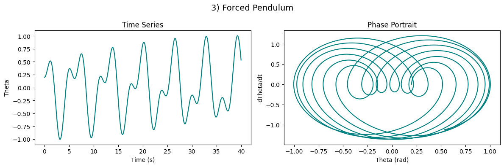
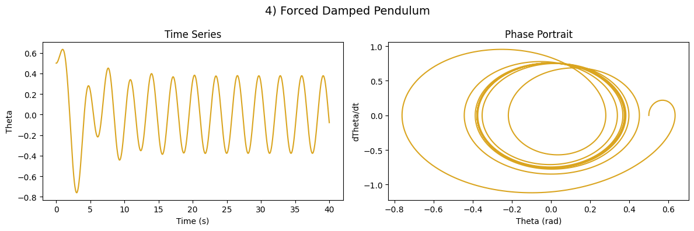
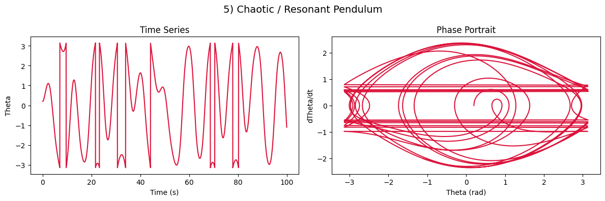

# Problem 2

## Forced Damped Pendulum Analysis

## 1. Introduction

The forced damped pendulum is a fundamental system in nonlinear dynamics. It exhibits a wide range of behaviors, from periodic motion to chaos, depending on system parameters such as damping, driving frequency, and amplitude. Understanding its dynamics is crucial in physics, engineering, and even biological systems.

This study explores the theoretical foundation of the system, computational simulations, and visualizations to better understand its motion.

---

## 2. Theoretical Foundation

The motion of a forced damped pendulum is governed by the differential equation:

$$
\frac{d^2\theta}{dt^2} + b\frac{d\theta}{dt} + \frac{g}{L}\sin\theta = A\cos(\omega t)
$$

where:
- $\theta$ is the angular displacement,
- $b$ is the damping coefficient,
- $g$ is the gravitational acceleration,
- $L$ is the pendulum length,
- $A$ is the external forcing amplitude,
- $\omega$ is the driving frequency.

### **2.1 Approximate Solution for Small-Angle Oscillations**
For small angles ($\theta \approx 0$), we use the linear approximation:

$$
\sin\theta \approx \theta
$$

which simplifies the equation to:

$$
\frac{d^2\theta}{dt^2} + b\frac{d\theta}{dt} + \frac{g}{L}\theta = A\cos(\omega t)
$$

This is a linear nonhomogeneous differential equation, with the solution comprising:

- **Homogeneous solution (natural response):**

  $$
  \theta_h (t) = C_1 e^{-\frac{b}{2} t} \cos \left( \omega_0 t + \phi \right)
  $$
  where $\omega_0 = \sqrt{\frac{g}{L} - \frac{b^2}{4}}$ is the damped natural frequency.

- **Particular solution (steady-state response):**

  $$
  \theta_p (t) = \frac{A}{\sqrt{(\omega_0^2 - \omega^2)^2 + (b\omega)^2}} \cos(\omega t - \delta)
  $$
  where $\delta$ is the phase shift.

Thus, the full solution is:

$$
\theta (t) = \theta_h (t) + \theta_p (t)
$$

### **2.2 Resonance Conditions**
Resonance occurs when the driving frequency $\omega$ is close to the system’s natural frequency. At resonance:

$$
\omega \approx \omega_0
$$

The system absorbs maximum energy, leading to large oscillations, particularly when damping is low.

---

## 3. Numerical Simulation
We numerically solve the equation using Python to analyze how different parameters influence $\theta(t)$.

### **3.1 Time Evolution of $\theta(t)$**



```python
import numpy as np
import matplotlib.pyplot as plt
from scipy.integrate import solve_ivp

# System parameters
g = 9.81  # gravity (m/s^2)
L = 1.0   # pendulum length (m)
b = 0.2   # damping coefficient
A = 1.2   # driving amplitude
omega = 2.0  # driving frequency

def pendulum(t, y):
    theta, omega_dot = y
    dtheta_dt = omega_dot
    domega_dt = -b * omega_dot - (g/L) * np.sin(theta) + A * np.cos(omega * t)
    return [dtheta_dt, domega_dt]

# Solve ODE
t_span = (0, 50)
y0 = [0.1, 0]  # Small initial displacement
t_eval = np.linspace(*t_span, 1000)
sol = solve_ivp(pendulum, t_span, y0, t_eval=t_eval)

# Plot solution
plt.figure(figsize=(8, 5))
plt.plot(sol.t, sol.y[0], label='Angular Displacement')
plt.xlabel('Time (s)')
plt.ylabel('Theta (rad)')
plt.title('Time Evolution of Theta')
plt.legend()
plt.grid()
plt.show()
```

**Figure 1: Time evolution of $\theta(t)$ for given system parameters.**

---

### **3.2 Regular vs. Chaotic Motion**
The transition from regular to chaotic motion occurs when forcing parameters ($A$, $\omega$) are increased. 

- **Regular Motion (Low Forcing)**: The system oscillates predictably.
- **Chaotic Motion (High Forcing)**: Motion becomes sensitive to initial conditions.

#### **Bifurcation Diagram**


**Figure 2: Bifurcation diagram showing how $\theta_{\max}$ 
changes with $\omega$.**

```python
omega_values = np.linspace(1.0, 2.5, 50)
theta_max = []

for w in omega_values:
    omega = w
    sol = solve_ivp(pendulum, t_span, y0, t_eval=t_eval)
    theta_max.append(np.max(sol.y[0][-100:]))

plt.figure(figsize=(8, 5))
plt.plot(omega_values, theta_max, 'bo', markersize=2)
plt.xlabel('Driving Frequency ω')
plt.ylabel('Max Theta (rad)')
plt.title('Bifurcation Diagram')
plt.grid()
plt.show()
```

**Figure 3: Phase space plot depicting system behavior.**
## 1. Simple Pendulum

**Equation of Motion:**

$$
\frac{d^2 \theta}{dt^2} + \frac{g}{L} \sin(\theta) = 0
$$




## 2. Damped Pendulum

$$
\frac{d^2\theta}{dt^2} + \gamma \frac{d\theta}{dt} + \frac{g}{L} \sin\theta = 0 
$$



## 3. Forced Pendulum

$$
\frac{d^2\theta}{dt^2} + \frac{g}{L} \sin\theta = A \cos(\omega t)
$$



## 4. Forced Damped Pendulum

$$
\frac{d^2 \theta}{dt^2} + b \frac{d\theta}{dt} + \frac{g}{L} \sin(\theta) = A \cos(\omega t)
$$




## 5. Chaotic/Resonant Pendulum

$$
\frac{d^2 \theta}{dt^2} + b \frac{d\theta}{dt} + \frac{g}{L} \sin(\theta) = A \cos(\omega t)
$$




---

## 4. Practical Applications
- **Energy Harvesting:** Converts mechanical oscillations into usable energy.
- **Structural Engineering:** Understanding resonance in bridges.
- **Electrical Engineering:** Analogous to forced RLC circuits.

---

## 5. Discussion
### **5.1 Limitations**
- The small-angle approximation is inaccurate for large displacements.
- Real-world damping is often nonlinear.
- External forcing may not be purely periodic.

### **5.2 Future Extensions**
- Explore **nonlinear damping** (e.g., air resistance effects).
- Analyze **stochastic forcing** (random perturbations in real-world applications).

---

## 6. Conclusion
This study demonstrates the transition from simple periodic motion to chaotic behavior in the forced damped pendulum. The combination of theoretical analysis and numerical simulation provides a deep insight into the system's behavior under different conditions.

[Open in Google Colab](https://colab.research.google.com/drive/1qWY-0tRAaNqDoGkIPwVe10uU-DeyS-Uq#scrollTo=4gMHXg1svuVu)