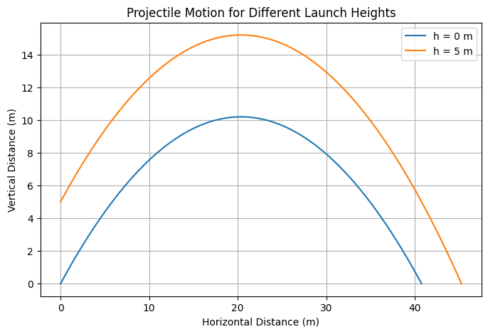
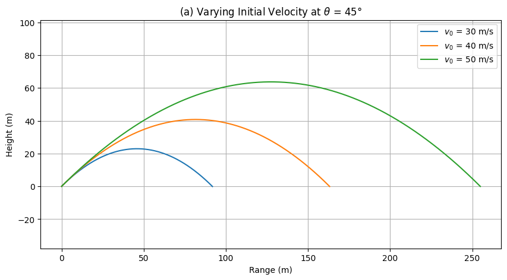
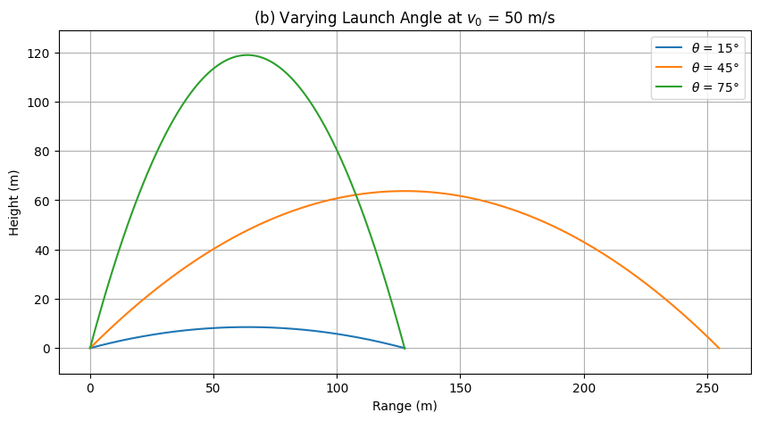

# Problem 2
# Forced Damped Pendulum Analysis

## 1. Theoretical Foundation

The forced damped pendulum is governed by the following differential equation:

$$
\frac{d^2\theta}{dt^2} + b\frac{d\theta}{dt} + \frac{g}{L}\sin\theta = A\cos(\omega t)
$$

where:
- $\theta$ is the angular displacement,
- $b$ is the damping coefficient,
- $g$ is the gravitational acceleration,
- $L$ is the length of the pendulum,
- $A$ is the amplitude of the external forcing,
- $\omega$ is the driving frequency.

### **1.1 Approximate Solution for Small-Angle Oscillations**
For small angles, we approximate:

$$
\sin\theta \approx \theta
$$

which simplifies the equation to:

$$
\frac{d^2\theta}{dt^2} + b\frac{d\theta}{dt} + \frac{g}{L}\theta = A\cos(\omega t)
$$

This is a linear nonhomogeneous differential equation. The general solution consists of:
- **Homogeneous solution** (natural response):

  $$
  \theta_h (t) = C_1 e^{-\frac{b}{2} t} \cos \left( \omega_0 t + \phi \right)
  $$
  where $\omega_0 = \sqrt{\frac{g}{L} - \frac{b^2}{4}}$ is the damped natural frequency.

- **Particular solution** (steady-state response):

  $$
  \theta_p (t) = \frac{A}{\sqrt{(\omega_0^2 - \omega^2)^2 + (b\omega)^2}} \cos(\omega t - \delta)
  $$
  where $\delta$ is the phase shift.

Thus, the full solution is:

$$
\theta (t) = \theta_h (t) + \theta_p (t)
$$

### **1.2 Resonance Conditions**
Resonance occurs when the driving frequency $\omega$ is close to the natural frequency of the system. At resonance:

$$
\omega \approx \omega_0
$$

Energy absorption is maximized, leading to large oscillations if damping is small.

---

## 2. Analysis of Dynamics

### **2.1 Influence of System Parameters**
- **Damping coefficient $b$:** Higher damping suppresses oscillations and prevents resonance.
- **Driving amplitude $A$:** Larger forcing increases the steady-state oscillation amplitude.
- **Driving frequency $\omega$:** Controls resonance and possible transition to chaotic motion.

-This plot shows how $\theta(t)$ evolves over time for different parameter values.


```py
import numpy as np
import matplotlib.pyplot as plt
from scipy.integrate import solve_ivp

# Define system parameters
g = 9.81  # gravity (m/s^2)
L = 1.0   # length of pendulum (m)
b = 0.2   # damping coefficient
A = 1.2   # driving amplitude
omega = 2.0  # driving frequency

# Define the equation of motion
def pendulum(t, y):
    theta, omega_dot = y
    dtheta_dt = omega_dot
    domega_dt = -b * omega_dot - (g/L) * np.sin(theta) + A * np.cos(omega * t)
    return [dtheta_dt, domega_dt]

# Time span and initial conditions
t_span = (0, 50)
y0 = [0.1, 0]  # Small initial displacement

t_eval = np.linspace(*t_span, 1000)
sol = solve_ivp(pendulum, t_span, y0, t_eval=t_eval)

# Plot the solution
plt.figure(figsize=(8, 5))
plt.plot(sol.t, sol.y[0])
plt.xlabel('Time (s)')
plt.ylabel('Theta (rad)')
plt.title('Time Evolution of Theta')
plt.grid()
plt.show()
```


### **2.2 Regular vs. Chaotic Motion**
At low amplitudes, motion remains periodic. However, increasing $A$ and modifying $\omega$ can lead to chaotic behavior, characterized by sensitivity to initial conditions.

### Regular


```python
omega_values = np.linspace(1.0, 2.5, 50)
theta_max = []

for w in omega_values:
    omega = w
    sol = solve_ivp(pendulum, t_span, y0, t_eval=t_eval)
    theta_max.append(np.max(sol.y[0][-100:]))

plt.figure(figsize=(8, 5))
plt.plot(omega_values, theta_max, 'bo', markersize=2)
plt.xlabel('Driving Frequency ω')
plt.ylabel('Max Theta (rad)')
plt.title('Bifurcation Diagram')
plt.grid()
plt.show()
```

```python
# Sample points at the period of the driving force
poincare_t = np.arange(0, 50, 2 * np.pi / omega)
poincare_theta = np.interp(poincare_t, sol.t, sol.y[0])
poincare_omega = np.interp(poincare_t, sol.t, sol.y[1])

plt.figure(figsize=(8, 5))
plt.scatter(poincare_theta, poincare_omega, s=10, color='r')
plt.xlabel('Theta (rad)')
plt.ylabel('Angular Velocity (rad/s)')
plt.title('Poincaré Section')
plt.grid()
plt.show()
```
### Chaotic

```python
plt.figure(figsize=(8, 5))
plt.plot(sol.y[0], sol.y[1], label='Phase Portrait')
plt.xlabel('Theta (rad)')
plt.ylabel('Angular Velocity (rad/s)')
plt.title('Phase Portrait of the Forced Damped Pendulum')
plt.legend()
plt.grid()
plt.show()
```

---

## 3. Practical Applications
- **Energy harvesting:** Extracting vibrational energy for power generation.
- **Suspension bridges:** Resonance effects in structural engineering.
- **Oscillating circuits:** Analogous to forced RLC circuits in electrical engineering.

---

## 4. Computational Implementation

We use Python to numerically solve and visualize the forced damped pendulum using the Runge-Kutta method.


```python
import numpy as np
import matplotlib.pyplot as plt
from scipy.integrate import solve_ivp

# Define system parameters
g = 9.81  # gravity (m/s^2)
L = 1.0   # length of pendulum (m)
b = 0.2   # damping coefficient
A = 1.2   # driving amplitude
omega = 2.0  # driving frequency

def pendulum(t, y):
    theta, omega_dot = y
    dtheta_dt = omega_dot
    domega_dt = -b * omega_dot - (g/L) * np.sin(theta) + A * np.cos(omega * t)
    return [dtheta_dt, domega_dt]

# Time span and initial conditions
t_span = (0, 50)
y0 = [0.1, 0]  # Small initial displacement

t_eval = np.linspace(*t_span, 1000)
sol = solve_ivp(pendulum, t_span, y0, t_eval=t_eval)

# Plot the solution
plt.plot(sol.t, sol.y[0])
plt.xlabel('Time (s)')
plt.ylabel('Theta (rad)')
plt.title('Forced Damped Pendulum Motion')
plt.grid()
plt.show()
```

### **4.1 Phase Portrait and Poincaré Section**
To visualize transitions to chaos, we plot phase portraits and Poincaré sections:


```python
plt.plot(sol.y[0], sol.y[1], label='Phase Portrait')
plt.xlabel('Theta (rad)')
plt.ylabel('Angular Velocity (rad/s)')
plt.legend()
plt.grid()
plt.show()
```

---

## 5. Discussion
### **5.1 Limitations**
- Small-angle approximation loses accuracy for large oscillations.
- Real-world damping is often nonlinear.
- External forcing may not always be purely periodic.

### **5.2 Extensions**
- **Nonlinear damping:** Explore air resistance effects.
- **Stochastic forcing:** Random perturbations for real-world modeling.

---

## 6. Conclusion
This study illustrates the rich dynamics of the forced damped pendulum, from simple harmonic motion to chaos. Through theoretical analysis and computational modeling, we gain insight into key factors influencing oscillatory systems.

