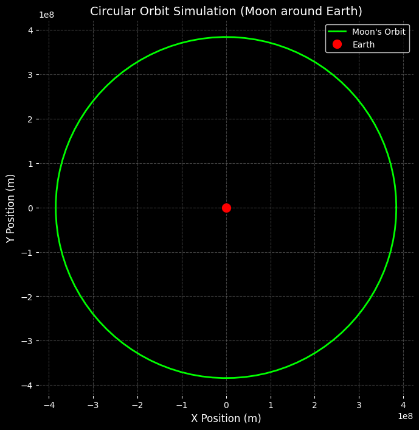
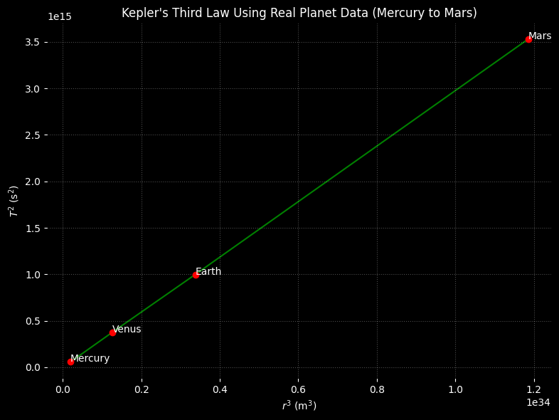

# Problem 1
# Orbital Period and Orbital Radius: Kepler's Third Law Analysis

This document analyzes the relationship between the square of the orbital period ($T^2$) and the cube of the orbital radius ($r^3$), as described by **Kepler's Third Law** for circular orbits.

Contents:
- Derivation of Kepler’s Third Law  
- Astronomical implications and applications  
- Real-world examples: Earth, Moon, Solar System  
- Graphical verification of $T^2 \propto r^3$

---

## 1. Introduction

Kepler's Third Law states that the square of the orbital period is proportional to the cube of the orbital radius:

$$
T^2 \propto r^3
$$

This law is fundamental in astronomy, used for studying planetary motion, satellite orbits, and exoplanets.

---

## 2. Definitions and Formulas

### 2.1 Definitions

- **Orbital Period ($T$)**: Time to complete one full orbit.
- **Orbital Radius ($r$)**: Distance from the center of the orbiting body to the center of the primary mass.
- **Gravitational Constant ($G$)**:
  $$
  G = 6.674 \times 10^{-11} \, \text{m}^3 \cdot \text{kg}^{-1} \cdot \text{s}^{-2}
  $$

### 2.2 Equations

- Centripetal force:
  $$
  F_c = \frac{m v^2}{r}
  $$

- Gravitational force:
  $$
  F_g = \frac{G M m}{r^2}
  $$

- Orbital velocity (for circular orbit):
  $$
  v = \frac{2 \pi r}{T}
  $$

- Kepler's Third Law (derived below):
  $$
  T^2 = \left( \frac{4 \pi^2}{G M} \right) r^3
  $$

---

## 3. Derivation of Kepler’s Third Law

Starting with force balance:

1. Set gravitational and centripetal forces equal:
   $$
   \frac{G M m}{r^2} = \frac{m v^2}{r}
   $$

2. Cancel $m$ and simplify:
   $$
   \frac{G M}{r} = v^2
   $$

3. Replace $v$ using $v = \frac{2 \pi r}{T}$:
   $$
   v^2 = \frac{4 \pi^2 r^2}{T^2}
   $$

4. Substitute into the previous equation:
   $$
   \frac{G M}{r} = \frac{4 \pi^2 r^2}{T^2}
   $$

5. Rearranging gives:
   $$
   G M T^2 = 4 \pi^2 r^3
   $$

6. Solving for $T^2$:
   $$
   T^2 = \left( \frac{4 \pi^2}{G M} \right) r^3
   $$

This confirms that $T^2 \propto r^3$.

---

## 4. Applications in Astronomy

- **Planetary Mass Estimation**:
  $$
  M = \frac{4 \pi^2 r^3}{G T^2}
  $$

- **Satellite Design**: Determines stable orbital periods.

- **Elliptical Orbits** (use semi-major axis $a$):
  $$
  T^2 = \left( \frac{4 \pi^2}{G M} \right) a^3
  $$

- **Exoplanet Systems**: Estimate mass of stars from observed $T$ and $a$.

---

## 5. Real-World Examples

### 5.1 Moon Orbiting Earth

Given:
- $T = 2.36 \times 10^6$ s  
- $r = 3.844 \times 10^8$ m

Estimate Earth's mass:
$$
M = \frac{4 \pi^2 r^3}{G T^2} \approx 5.97 \times 10^{24} \, \text{kg}
$$

### 5.2 Earth and Mars (Orbiting the Sun)

- Earth:  
  $T = 3.156 \times 10^7$ s, $r = 1.496 \times 10^{11}$ m

- Mars:  
  $T = 5.94 \times 10^7$ s, $r = 2.279 \times 10^{11}$ m

Check:
$$
\frac{T^2}{r^3} \approx \text{constant} \quad \Rightarrow \quad \text{Kepler’s law holds}
$$

---

## 6. Elliptical Orbit Generalization

For non-circular orbits, use the semi-major axis $a$:

$$
T^2 = \left( \frac{4 \pi^2}{G M} \right) a^3
$$

Applicable to:
- Planets
- Moons
- Comets
- Binary stars

---

## 7. Extension to Elliptical Orbits

For elliptical orbits, Kepler’s Third Law is generalized by replacing the orbital radius $r$ with the semi-major axis $a$:

$$
T^2 = \left( \frac{4 \pi^2}{G M} \right) a^3
$$

This accounts for the fact that the radius is not constant in an elliptical path.

### Key Applications:

- **Planetary Orbits**: Most planetary orbits are slightly elliptical.  
  Example: Earth’s eccentricity is approximately $e \approx 0.0167$.
- **Comets and Asteroids**: Often follow highly elliptical orbits with large semi-major axes.
- **Binary Star Systems**: The law applies to two stars orbiting their mutual center of mass.

Although the derivation for elliptical orbits involves Kepler’s First and Second Laws, the resulting formula retains the same structure. This makes Kepler’s Third Law broadly applicable to a wide range of celestial systems.

---

## 8. Conclusion

Kepler’s Third Law:

$$
T^2 \propto r^3
$$

is a fundamental principle of orbital mechanics. It allows us to:

- Estimate the masses of celestial bodies
- Determine orbital distances
- Predict satellite trajectories

This document has:

- Derived the law using Newtonian mechanics
- Verified its validity through real-world data (e.g., Moon and Solar System planets)
- Illustrated the relationship graphically and numerically
- Extended its use to elliptical orbits

### Further Exploration:

- Simulate elliptical orbits using numerical integration (e.g., solving Kepler’s Equation)
- Use exoplanet orbital data to estimate stellar masses
- Investigate relativistic corrections in strong gravitational fields

This analysis provides a solid foundation for modeling orbits in both classical and more advanced astrophysical contexts.

[Open in Google Colab](https://colab.research.google.com/drive/1RmnfrKEtL2qNTCBlQ-s-TaelBwUYo7F9?usp=sharing)