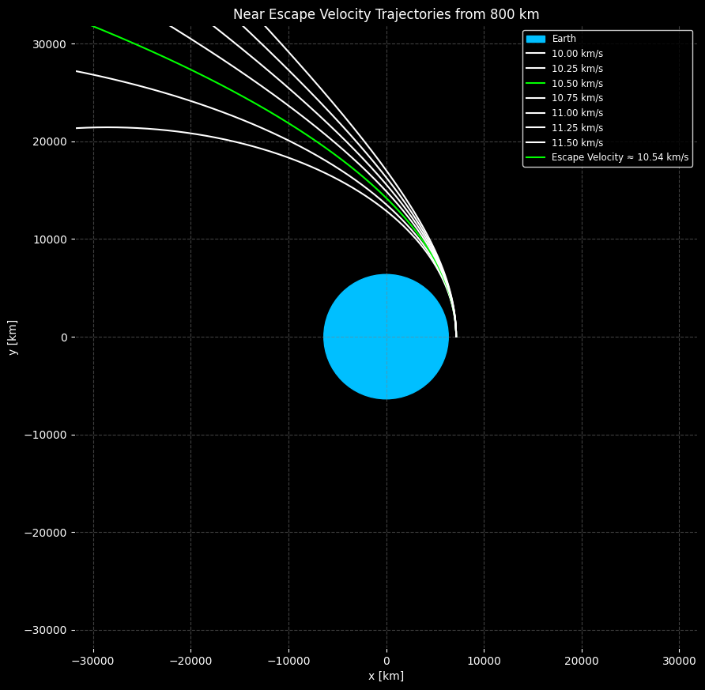

# Problem 1
# 🌌 Gravity and Orbital Mechanics: Kepler’s Third Law

## 📚 Why It Matters

Kepler's Third Law reveals a beautiful relationship in orbital motion:

> **The square of a planet’s orbital period** ($T^2$) is **proportional** to **the cube of its orbital radius** ($r^3$).

This principle helps astronomers and engineers:
- Predict satellite and planetary motion.
- Estimate masses of stars and planets.
- Design space missions and satellite orbits.

---

## 🧠 Core Physics Concepts

### 🧲 1. Gravitational Force

The attractive force between two masses:

$$
F = \frac{G M m}{r^2}
$$

Where:
- $F$ = gravitational force (Newtons)
- $G = 6.674 \times 10^{-11} \, \text{N} \cdot \text{m}^2/\text{kg}^2$ (gravitational constant)

- $M$, $m$ = masses of the two objects (kg)
- $r$ = distance between the objects’ centers (m)

---

### 🔁 2. Centripetal Force (for Circular Orbits)

The inward force keeping a body in circular motion:

$$
F = \frac{m v^2}{r}
$$

Where:
- $v$ = orbital speed (m/s)

---

### 🚀 3. Orbital Speed

For an object in circular orbit:

$$
v = \frac{2\pi r}{T}
$$

Where:
- $T$ = orbital period (seconds)

---

## 📐 Derivation of Kepler's Third Law

Start by equating gravitational and centripetal forces:

$$
\frac{G M m}{r^2} = \frac{m v^2}{r}
$$

Cancel out $m$:

$$
\frac{G M}{r^2} = \frac{v^2}{r}
$$

Substitute $v = \frac{2\pi r}{T}$:

$$
\frac{G M}{r^2} = \frac{(2\pi r / T)^2}{r}
$$

Simplify:

$$
\frac{G M}{r^2} = \frac{4\pi^2 r}{T^2}
$$

Solve for $T^2$:

$$
T^2 = \frac{4\pi^2}{G M} r^3
$$

✅ **Conclusion**: For a given central mass $M$,  
**$T^2 \propto r^3$**

---

## 🧮 Summary of Useful Formulas

- Gravitational Force: $F = \frac{G M m}{r^2}$
- Centripetal Force: $F = \frac{m v^2}{r}$
- Orbital Speed: $v = \frac{2\pi r}{T}$
- **Kepler’s Third Law**: $T^2 = \frac{4\pi^2}{G M} r^3$

---

## 🌕 Example: The Moon Orbiting Earth

Let’s plug in real numbers:

- Orbital radius: $r = 3.84 \times 10^8$ m  
- Orbital period: $T = 27.3$ days $= 2.36 \times 10^6$ s  
- Earth's mass: $M = 5.97 \times 10^{24}$ kg

Using Kepler’s Law:

$$
T^2 = \frac{4\pi^2}{G M} r^3
$$

This confirms the real Moon’s period! 🌙

---

## 📊 Visualization in Python 



```python
import numpy as np
import matplotlib.pyplot as plt

# Constants
G = 6.674e-11        # Gravitational constant (m^3 kg^-1 s^-2)
M = 5.97e24          # Mass of Earth (kg)

# Generate orbital radii (from 10,000 km to 500,000 km)
radii = np.linspace(1e7, 5e8, 200)  # in meters

# Apply Kepler's Third Law
T_squared = (4 * np.pi**2 / (G * M)) * radii**3

# Plot T² vs r³
plt.figure(figsize=(8, 5))
plt.plot(radii**3, T_squared, label="Kepler's Third Law: $T^2 \\propto r^3$", color="royalblue")
plt.xlabel("$r^3$ (m³)")
plt.ylabel("$T^2$ (s²)")
plt.title("📈 Verifying Kepler's Third Law")
plt.legend()
plt.grid(True)
plt.tight_layout()
plt.show()
