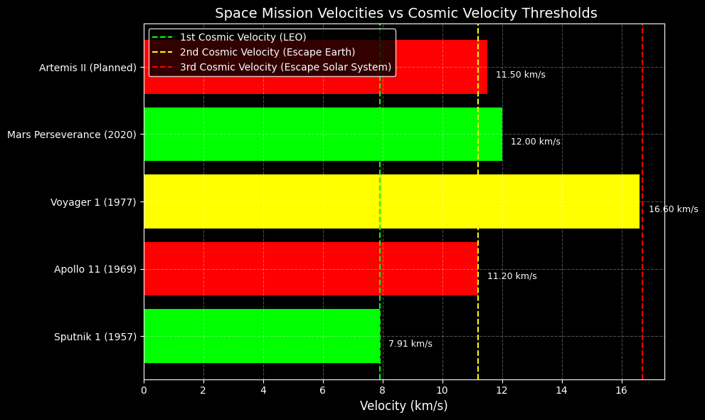

# Problem 2

##  Escape and Cosmic Velocities

This repository presents a detailed study of escape and cosmic velocities, prepared for **[Course Name]** at **[University Name]**. It includes definitions, derivations, visualizations, and significance of these velocities for **Earth**, **Mars**, and **Jupiter**.

---

##  Problem Statement

This project aims to:

- Define the **first**, **second**, and **third cosmic velocities** and explain their physical significance.
- Derive the mathematical formulas and analyze influencing parameters.
- Calculate and visualize these velocities for three planets.
- Discuss their relevance in satellite launches, interplanetary missions, and interstellar travel.

---

##  Definitions and Formulas

###  Definitions

- **Escape Velocity**: The minimum speed required to escape a celestial body's gravity without additional propulsion.
- **First Cosmic Velocity**: The velocity required to maintain a stable low circular orbit near the surface.
- **Second Cosmic Velocity**: The speed needed to completely escape a planet’s gravity.
- **Third Cosmic Velocity**: The velocity required to leave the Solar System from a planet’s orbit.

---

###  Useful Formulas

**Gravitational Constant:**

$$ G = 6.67430 \times 10^{-11} \, \text{m}^3 \, \text{kg}^{-1} \, \text{s}^{-2} $$

**General Parameters:**

- \( M \): Mass of celestial body (kg)  
- \( r \): Radius of celestial body (m)

**First Cosmic Velocity (orbital velocity):**

$$ v_1 = \sqrt{\frac{G M}{r}} $$

**Second Cosmic Velocity (escape velocity):**

$$ v_2 = \sqrt{\frac{2 G M}{r}} \quad \text{so} \quad v_2 = \sqrt{2} \cdot v_1 $$

**Third Cosmic Velocity (escape from Solar System):**

$$
v_3 \approx \sqrt{v_{\text{esc,Sun}}^2 + v_2^2}
$$

where:

$$
v_{\text{esc,Sun}} = \sqrt{\frac{2 G M_{\text{Sun}}}{r_{\text{orbit}}}}
$$

---

##  Mathematical Derivations

###  First Cosmic Velocity

From centripetal force balance:

$$
\frac{G M m}{r^2} = \frac{m v_1^2}{r}
\quad \Rightarrow \quad
v_1 = \sqrt{\frac{G M}{r}}
$$

---

###  Second Cosmic Velocity

From conservation of energy:

$$
\frac{1}{2} m v_2^2 = \frac{G M m}{r}
\quad \Rightarrow \quad
v_2 = \sqrt{\frac{2 G M}{r}}
$$

---

###  Third Cosmic Velocity

Combining the escape velocities from both the planet and the Sun:

$$
v_3 \approx \sqrt{
\left( \sqrt{ \frac{2 G M_{\text{Sun}}}{r_{\text{orbit}}} } \right)^2 + v_2^2
}
$$

---

##  Parameters for Celestial Bodies

| Body     | Mass (kg)                    | Radius (m)                 | Orbital Radius (m)           |
|----------|------------------------------|-----------------------------|-------------------------------|
| Earth    | $5.972 \times 10^{24}$       | $6.371 \times 10^6$         | $1.496 \times 10^{11}$        |
| Mars     | $6.417 \times 10^{23}$       | $3.390 \times 10^6$         | $2.279 \times 10^{11}$        |
| Jupiter  | $1.899 \times 10^{27}$       | $6.991 \times 10^7$         | $7.785 \times 10^{11}$        |
| Sun      | $1.989 \times 10^{30}$       | —                           | —                             |

---

##  Python Implementation (for Google Colab)

---

## 📊 Results

| Body     | $v_1$ (km/s) | $v_2$ (km/s) | $v_3$ (km/s) |
|----------|--------------|--------------|--------------|
| Earth    | ~7.91        | ~11.19       | ~42.14       |
| Mars     | ~3.55        | ~5.03        | ~22.96       |
| Jupiter  | ~18.55       | ~26.24       | ~29.78       |

---

##  Importance in Space Exploration

###  Satellite Launches

- **First cosmic velocity** is used to launch satellites into low Earth orbit.
- Example: The ISS orbits at ~7.66 km/s, close to Earth’s $v_1$.

###  Planetary Missions

- **Second cosmic velocity** defines the required speed to send spacecraft from a planet.
- Example: NASA's Perseverance mission had to exceed Earth’s $v_2 = 11.19\ \text{km/s}$.

###  Interstellar Travel

- **Third cosmic velocity** is crucial for missions beyond the Solar System.
- Example: Voyager 1 surpassed Earth’s $v_3 \approx 42.14\ \text{km/s}$ using gravity assists.

##  Relating Cosmic Velocities to Historical and Planned Space Missions

Space missions rely heavily on the concept of **cosmic velocities** to achieve orbit, reach other planets, or even escape the solar system. These velocities define the minimum speed needed for different types of motion in space:

- **First Cosmic Velocity** – To achieve orbit (LEO)
- **Second Cosmic Velocity** – To escape Earth’s gravity
- **Third Cosmic Velocity** – To escape the Sun’s gravity from Earth’s orbit

---

##  Key Equations

Let:

$$
\begin{align*}
v_1 &\text{ — first cosmic velocity (orbital speed)} \\
v_2 &\text{ — second cosmic velocity (escape from planet)} \\
v_3 &\text{ — third cosmic velocity (escape solar system)}
\end{align*}
$$

---

The formulas are:

$$
v_1 = \sqrt{\frac{GM}{R}}
$$

$$
v_2 = \sqrt{2} \cdot v_1
$$

$$
v_3 = \sqrt{2GM_\odot \left( \frac{1}{R_{\text{Earth orbit}}} \right)}
$$

---

Where:

$$
\begin{align*}
G &\text{ — gravitational constant} \\
M &\text{ — mass of the planet (Earth, Mars, etc.)} \\
R &\text{ — radius from the planet's center} \\
M_\odot &\text{ — mass of the Sun}
\end{align*}
$$

---

[Open in Google Colab](https://colab.research.google.com/drive/1IO4Mrd2AMHcfg7q5VWXzSpWjNxdjh7bd?usp=sharing)