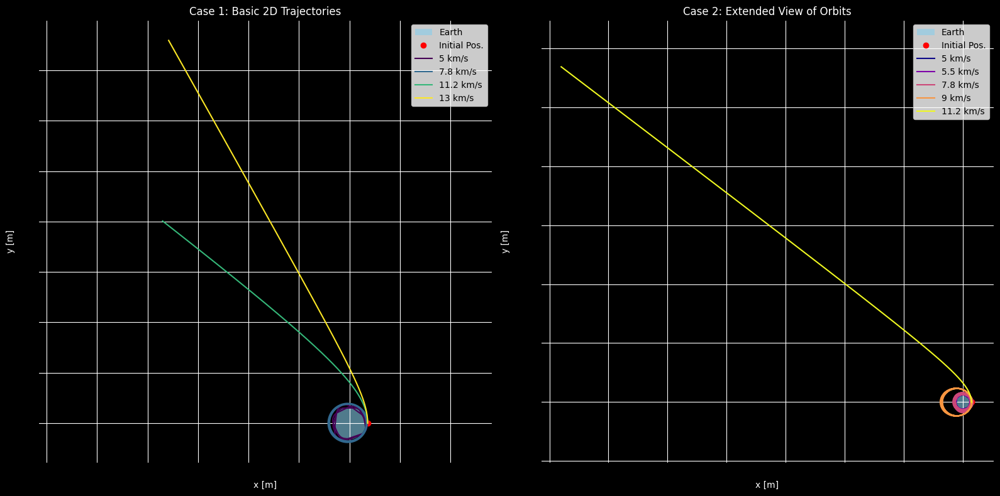

# Problem 3
# Trajectories of a Freely Released Payload Near Earth

## Table of Contents
- [Introduction](#introduction)
- [Theoretical Background](#theoretical-background)
  - [Newton's Law of Gravitation](#newtons-law-of-gravitation)
  - [Kepler's Laws](#keplers-laws)
  - [Types of Trajectories](#types-of-trajectories)
  - [Escape Velocity](#escape-velocity)
- [Mathematical Formulation](#mathematical-formulation)
  - [Equations of Motion](#equations-of-motion)
  - [Orbital Elements](#orbital-elements)
- [Numerical Analysis and Simulation](#numerical-analysis-and-simulation)
  - [Python Implementation](#python-implementation)
  - [Simulation Cases](#simulation-cases)
  - [Simulation Results](#simulation-results)
- [Discussion of Applications](#discussion-of-applications)
  - [Orbital Insertion](#orbital-insertion)
  - [Reentry Scenarios](#reentry-scenarios)
  - [Escape Scenarios](#escape-scenarios)
- [Conclusion](#conclusion)
- [References](#references)

## Introduction

This document explores the dynamics of a payload released from a moving rocket near Earth. The trajectory of such a payload depends critically on initial conditions (position and velocity) and the gravitational field of Earth. Understanding these trajectories is essential for various space applications, including satellite deployment, payload delivery, and atmospheric reentry.

We will analyze the different types of possible trajectories based on orbital mechanics, implement numerical simulations to visualize these trajectories, and discuss practical applications in space missions.

## Theoretical Background

### Newton's Law of Gravitation

Newton's Law of Universal Gravitation forms the foundation of orbital mechanics. For a payload of mass $m$ near Earth (mass $M$), the gravitational force is:

$$F = G\frac{Mm}{r^2}$$

where:
- $G = 6.674 \times 10^{-11} \, \text{m}^3 \text{kg}^{-1} \text{s}^{-2}$ is the gravitational constant
- $r$ is the distance from the center of Earth to the payload
- $M = 5.972 \times 10^{24} \, \text{kg}$ is Earth's mass

### Kepler's Laws

Kepler's laws describe the motion of objects in gravitational fields:

1. **First Law**: All objects move in elliptical orbits with the central body at one focus.
2. **Second Law**: A line connecting the object and the central body sweeps out equal areas in equal time intervals.
3. **Third Law**: The square of the orbital period is proportional to the cube of the semi-major axis.

Mathematically, the third law can be expressed as:

$$T^2 = \frac{4\pi^2}{GM}a^3$$

where $T$ is the orbital period and $a$ is the semi-major axis of the orbit.

### Types of Trajectories

The trajectory of a payload depends on its specific mechanical energy $\varepsilon$, which is the sum of kinetic and potential energy per unit mass:

$$\varepsilon = \frac{v^2}{2} - \frac{GM}{r}$$

This energy determines the type of conic section the trajectory will follow:

1. **Circular orbit** ($\varepsilon = -\frac{GM}{2r}$): The payload follows a perfect circle around Earth.
2. **Elliptical orbit** ($-\frac{GM}{2r} < \varepsilon < 0$): The payload follows an ellipse with Earth at one focus.
3. **Parabolic trajectory** ($\varepsilon = 0$): The payload follows a parabola and has exactly escape velocity.
4. **Hyperbolic trajectory** ($\varepsilon > 0$): The payload has more than escape velocity and will never return.

### Escape Velocity

The escape velocity is the minimum speed needed for an object to escape Earth's gravitational field. At a distance $r$ from the center of Earth, the escape velocity is:

$$v_{esc} = \sqrt{\frac{2GM}{r}}$$

At Earth's surface ($r = R_{\text{Earth}} \approx 6,371 \, \text{km}$), the escape velocity is approximately 11.2 km/s.

## Mathematical Formulation

### Equations of Motion

For a payload in Earth's gravitational field, the equation of motion in vector form is:

$$\frac{d^2\vec{r}}{dt^2} = -\frac{GM}{r^3}\vec{r}$$

In Cartesian coordinates, this becomes three coupled second-order differential equations:

$$\frac{d^2x}{dt^2} = -\frac{GM}{r^3}x$$
$$\frac{d^2y}{dt^2} = -\frac{GM}{r^3}y$$
$$\frac{d^2z}{dt^2} = -\frac{GM}{r^3}z$$

where $r = \sqrt{x^2 + y^2 + z^2}$

### Orbital Elements

The shape and orientation of an orbit can be described by six orbital elements:

1. **Semi-major axis** ($a$): Defines the size of the orbit
2. **Eccentricity** ($e$): Defines the shape of the orbit (0 for circular, 0-1 for elliptical, 1 for parabolic, >1 for hyperbolic)
3. **Inclination** ($i$): Angle between the orbital plane and the reference plane
4. **Longitude of the ascending node** ($\Omega$): Angle between the reference direction and the point where the orbit crosses the reference plane
5. **Argument of periapsis** ($\omega$): Angle between the ascending node and the periapsis
6. **True anomaly** ($\nu$): Angle between the periapsis and the current position

For an elliptical orbit, the position of the payload can be calculated using:

$$r = \frac{a(1-e^2)}{1+e\cos\nu}$$

## Numerical Analysis and Simulation

### Python Implementation

Below is a Python implementation to simulate and visualize trajectories of a payload under Earth's gravitational influence:

### Simulation Cases

We will analyze two main cases:

#### Case 1: Basic Trajectory Analysis
- Earth positioned at the center of the plot
- Initial position set at 800 km above Earth's surface (on the right side)
- Test multiple initial velocities from 5 km/s to 13 km/s
- Focus on showing all trajectory types in a single view

#### Case 2: Detailed View of Elliptical Orbits
- Same initial conditions as Case 1
- Adjusted plot scale to better visualize elliptical orbits
- Added more intermediate velocities (5.2, 5.4, 5.6, 5.8 km/s) to show the transition between different orbital shapes

### Simulation Results

The simulation demonstrates several trajectory types based on the initial velocity:

1. **Sub-orbital Trajectories**: At lower velocities (around 5-6 km/s), the payload follows an elliptical path that intersects with Earth's surface, resulting in a return to Earth.

2. **Elliptical Orbits**: As velocity increases (around 7-10 km/s), the payload achieves stable elliptical orbits around Earth, with the eccentricity decreasing as velocity increases.

3. **Circular Orbit**: At approximately 7.85 km/s at 800 km altitude, the orbit becomes nearly circular.

4. **Parabolic Trajectory**: At exactly escape velocity (about 11.0 km/s at 800 km altitude), the payload follows a parabolic path and escapes Earth's gravity asymptotically.

5. **Hyperbolic Trajectories**: With velocity greater than escape velocity (>11.0 km/s), the payload follows a hyperbolic path and escapes Earth's gravity with excess kinetic energy.

* Case 1:  Multiple trajectories from 800 km above Earth's surface with different initial velocities (5-13 km/s)*

* Case 2: Extended view showing the full shapes of elliptical orbits at different velocities*

## Discussion of Applications

### Orbital Insertion

To insert a payload into a specific orbit, we need to calculate the required velocity and direction at the release point. This involves:

1. **Circular Orbit Insertion**: For a circular orbit at altitude $h$, the required velocity is:

$$v_{circular} = \sqrt{\frac{GM}{R+h}}$$

For our simulation at 800 km altitude, this equals approximately 7.45 km/s.

2. **Elliptical Orbit Insertion**: For an elliptical orbit with perigee at release point (altitude $h$) and desired apogee at altitude $h_{apogee}$, the velocity is:

$$v_{elliptical} = \sqrt{GM \left(\frac{2}{R+h} - \frac{1}{R+h+h_{apogee}}\right)}$$

3. **Hohmann Transfer Orbits**: The most fuel-efficient way to transfer between two circular orbits.

### Reentry Scenarios

For payloads intended to return to Earth, key considerations include:

1. **Entry Angle**: In our simulation, trajectories with velocities below about 6 km/s at 800 km altitude result in reentry.

2. **Deceleration Planning**: Controlled reentry requires precise velocity adjustments to manage:
   - Atmospheric heating
   - G-forces experienced by the payload
   - Landing location precision

3. **Atmospheric Effects**: Our simulation doesn't account for atmospheric drag, which significantly affects real-world reentry trajectories below approximately 100 km altitude.

### Escape Scenarios

For missions beyond Earth orbit, the payload must achieve at least escape velocity:

1. **Escape Velocity Calculation**: At 800 km altitude, escape velocity is:

$$v_{escape} = \sqrt{\frac{2GM}{R+h}} \approx 10.55 \text{ km/s}$$

2. **Deep Space Missions**: Velocities above escape velocity (hyperbolic trajectories) are used for:
   - Planetary exploration missions
   - Solar system escape missions
   - Fast transit trajectories to other planets

3. **Gravity Assists**: Real missions often use planetary gravity assists to achieve the necessary velocity without requiring as much propellant.

## Conclusion

The trajectory of a payload released near Earth depends critically on its initial conditions, particularly its velocity magnitude and direction relative to Earth's gravitational field. Our simulations demonstrate that small changes in initial velocity can lead to drastically different trajectories, from sub-orbital flights to stable orbits to escape trajectories.

Key findings from our analysis:

1. At 800 km altitude, velocities below approximately 7.2 km/s result in sub-orbital trajectories that intersect with Earth.

2. Velocities between approximately 7.2 km/s and 10.5 km/s result in elliptical orbits of varying eccentricity.

3. A velocity of approximately 7.85 km/s results in a nearly circular orbit.

4. Velocities above 10.5 km/s result in escape trajectories (parabolic or hyperbolic).

For practical applications, additional factors would need to be considered, including:
- Atmospheric drag at lower altitudes
- Solar and lunar gravitational perturbations
- Earth's non-uniform gravitational field
- Propulsion systems for trajectory corrections

Understanding these orbital dynamics principles is essential for mission planning in all areas of space exploration, from satellite deployment to human spaceflight to interplanetary missions.

------------

[Open in Google Colab](https://colab.research.google.com/drive/14r_2HuwKZ0kPmcRLBgSBMw9AxhpQDNrx?usp=sharing)

## References

1. Vallado, D. A. (2013). *Fundamentals of Astrodynamics and Applications*. Microcosm Press.
2. Curtis, H. D. (2020). *Orbital Mechanics for Engineering Students*. Butterworth-Heinemann.
3. Bate, R. R., Mueller, D. D., & White, J. E. (1971). *Fundamentals of Astrodynamics*. Dover Publications.
4. NASA. (2011). *NASA's Guide to Orbital Mechanics*. NASA Technical Reports.
5. Wertz, J. R. (2012). *Mission Geometry; Orbit and Constellation Design and Management*. Microcosm Press.
   