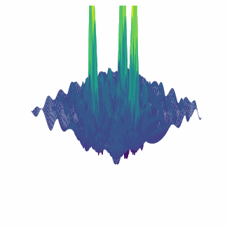

# Problem 1
# Wave Interference Patterns on Water Surface

## 1. Theoretical Foundation

### 1.1 Key Definitions

- **Wave**: A disturbance that propagates through a medium, transferring energy without transferring matter.
- **Interference**: The phenomenon that occurs when two or more waves overlap, resulting in a new wave pattern.
- **Constructive Interference**: Occurs when waves align such that their crests and troughs coincide, resulting in a wave with increased amplitude.
- **Destructive Interference**: Occurs when waves align such that the crest of one wave coincides with the trough of another, resulting in decreased amplitude or complete cancellation.
- **Coherent Sources**: Wave sources that maintain a constant phase relationship over time.
- **Phase Difference**: The difference in the oscillation stage between two waves.

### 1.2 Mathematical Representation of Water Surface Waves

For a circular wave on a water surface emanating from a point source at $(x_0, y_0)$, the displacement is given by:

$$\eta(x, y, t) = \frac{A}{\sqrt{r}} \cdot \cos(kr - \omega t + \phi)$$

Where:
- $\eta(x, y, t)$ represents the displacement of the water surface at point $(x, y)$ and time $t$
- $A$ is the wave amplitude
- $r = \sqrt{(x - x_0)^2 + (y - y_0)^2}$ is the distance from the source to point $(x, y)$
- $k = \frac{2\pi}{\lambda}$ is the wave number, with $\lambda$ being the wavelength
- $\omega = 2\pi f$ is the angular frequency, with $f$ being the frequency
- $\phi$ is the initial phase of the wave

### 1.3 Principle of Superposition

When multiple waves overlap at a point, the resulting displacement is the algebraic sum of the individual wave displacements:

$$\eta_{\text{sum}}(x, y, t) = \sum_{i=1}^{N} \eta_i(x, y, t)$$

For $N$ sources positioned at coordinates $(x_i, y_i)$ with $i = 1, 2, ..., N$, the total displacement becomes:

$$\eta_{\text{sum}}(x, y, t) = \sum_{i=1}^{N} \frac{A}{\sqrt{r_i}} \cdot \cos(kr_i - \omega t + \phi_i)$$

Where $r_i = \sqrt{(x - x_i)^2 + (y - y_i)^2}$ is the distance from the $i$-th source to the point $(x, y)$.

## 2. Interference Patterns Analysis

### 2.1 Conditions for Interference Extrema

For two sources with the same amplitude, frequency, and phase:

- **Constructive Interference**: Occurs when the path difference $\Delta r = r_2 - r_1 = n\lambda$, where $n = 0, 1, 2, ...$
- **Destructive Interference**: Occurs when $\Delta r = (n + \frac{1}{2})\lambda$, where $n = 0, 1, 2, ...$

For multiple sources arranged in regular polygon vertices, the interference pattern becomes more complex, with multiple regions of constructive and destructive interference.

### 2.2 Amplitude Decay with Distance

Note that the amplitude of a circular wave decreases with distance according to $\frac{1}{\sqrt{r}}$. This is because the energy of the wave spreads out over an increasingly larger circumference as the wave propagates.

## 3. Regular Polygon Source Configurations

### 3.1 Equilateral Triangle Configuration

For sources placed at the vertices of an equilateral triangle with side length $a$, the coordinates can be chosen as:
- Source 1: $(0, 0)$
- Source 2: $(a, 0)$
- Source 3: $(a/2, a\sqrt{3}/2)$

### 3.2 Square Configuration

For sources placed at the vertices of a square with side length $a$, the coordinates can be chosen as:
- Source 1: $(0, 0)$
- Source 2: $(a, 0)$
- Source 3: $(a, a)$
- Source 4: $(0, a)$

### 3.3 Regular Pentagon Configuration

For sources placed at the vertices of a regular pentagon with side length $a$, the coordinates can be determined using the formula:
- Source $i$: $(R\cos(2\pi i/5), R\sin(2\pi i/5))$ for $i = 0, 1, 2, 3, 4$
  where $R = \frac{a}{2\sin(\pi/5)}$ is the radius of the circumscribed circle.

## 4. Mathematical Solution and Implementation Approach

To analyze the interference patterns:

1. Define the positions of the sources based on the chosen regular polygon.
2. Calculate the distance $r_i$ from each source to every point $(x, y)$ in the region of interest.
3. Compute the displacement contribution $\eta_i(x, y, t)$ from each source.
4. Apply the superposition principle to find the total displacement $\eta_{\text{sum}}(x, y, t)$.
5. Visualize the interference pattern at a specific time $t$ by plotting $\eta_{\text{sum}}(x, y, t)$.

## 5. Analysis of Interference Patterns

### 5.1 Static Interference Pattern

For a fixed time $t$, the interference pattern shows regions of high amplitude (constructive interference) and low amplitude (destructive interference). These regions form specific geometric patterns depending on the arrangement of sources.

### 5.2 Time Evolution

As time progresses, the interference pattern evolves, with waves propagating outward from each source. However, the locations of constructive and destructive interference maintain their geometric arrangement if all sources have the same frequency.

### 5.3 Hyperbolic Patterns

For two sources, the interference pattern forms hyperbolic curves representing points where the path difference $\Delta r$ is constant. These are known as hyperbolas of constant phase difference.

### 5.4 Symmetry Considerations

The interference pattern inherits symmetry properties from the source arrangement. For regular polygons, the pattern exhibits the same rotational symmetry as the polygon itself.

# Examples and Analysis of Interference Patterns

## One Source

<table>
  <tr>
    <td></td>
    <td></td>
  </tr>
</table>

## Two Sources

<table>
  <tr>
    <td></td>
    <td></td>
  </tr>
</table>

## Triangle Sources

<table>
  <tr>
    <td></td>
    <td></td>
  </tr>
</table>

## Pentagon Sources

<table>
  <tr>
    <td></td>
    <td></td>
  </tr>
</table>

## Detailed Analysis of Interference Patterns for Different Polygon Configurations

### 1. Equilateral Triangle Configuration Analysis

When three coherent wave sources are placed at the vertices of an equilateral triangle, the resulting interference pattern exhibits three-fold rotational symmetry. Let's analyze this configuration in detail:

#### Key Features:

- **Interference Maxima**: Points where the path difference from the three sources satisfies the condition for constructive interference occur along specific curves.
- **Interference Minima**: Similarly, destructive interference occurs along curves where the path differences result in wave cancellation.
- **Central Region**: Near the center of the triangle, complex interference patterns form due to the equidistant nature of the sources.

#### Mathematical Analysis:

For an equilateral triangle with vertices at $(0,0)$, $(a,0)$, and $(a/2, a\sqrt{3}/2)$, the total displacement at a point $(x,y)$ at time $t$ is:

$$\eta_{\text{sum}}(x, y, t) = \frac{A}{\sqrt{r_1}} \cos(kr_1 - \omega t + \phi) + \frac{A}{\sqrt{r_2}} \cos(kr_2 - \omega t + \phi) + \frac{A}{\sqrt{r_3}} \cos(kr_3 - \omega t + \phi)$$

Where:
- $r_1 = \sqrt{x^2 + y^2}$
- $r_2 = \sqrt{(x-a)^2 + y^2}$
- $r_3 = \sqrt{(x-a/2)^2 + (y-a\sqrt{3}/2)^2}$

For constructive interference to occur, the phase differences between pairs of waves must be integer multiples of $2\pi$, which leads to path difference conditions:

$$|r_i - r_j| = n\lambda, \quad n = 0, 1, 2, ...$$

For all pairs $(i,j)$ among the three sources.

### 2. Square Configuration Analysis

Four sources placed at the vertices of a square create interference patterns with four-fold rotational symmetry.

#### Key Features:

- **Checkerboard Pattern**: In the central region of the square, a checkerboard-like pattern of interference maxima and minima emerges.
- **Diagonal Symmetry**: Strong interference bands appear along the diagonals of the square.
- **Edge Effects**: Complex interference patterns appear outside the square, with hyperbolic curves forming as the loci of constant path differences.

#### Mathematical Analysis:

For a square with vertices at $(0,0)$, $(a,0)$, $(a,a)$, and $(0,a)$, the total displacement is given by:

$$\eta_{\text{sum}}(x, y, t) = \sum_{i=1}^{4} \frac{A}{\sqrt{r_i}} \cos(kr_i - \omega t + \phi)$$

Where $r_i$ represents the distance from point $(x,y)$ to the $i$-th source.

### 3. Regular Pentagon Configuration Analysis

Five sources arranged at the vertices of a regular pentagon produce a complex interference pattern with five-fold rotational symmetry.

#### Key Features:

- **Star-like Pattern**: The interference pattern forms a star-like structure with five-fold symmetry.
- **Concentric Rings**: Multiple concentric rings of constructive and destructive interference form around the center of the pentagon.
- **Nodal Lines**: Five distinct nodal lines (where displacement is consistently near zero) radiate outward from the center.

#### Relation to Optical Phenomena:

This configuration is particularly interesting as it relates to optical diffraction patterns from apertures with five-fold symmetry. The mathematics of these patterns connects to concepts in crystallography and quasicrystals.

## Numerical Results and Visual Analysis

Below are the results from our numerical simulations showing the interference patterns for different polygon configurations.

### Example 1: Equilateral Triangle Configuration

For wavelength $\lambda = 0.3$ and sources at the vertices of an equilateral triangle with side length $a = 1.0$:

The interference pattern shows three primary directions of constructive interference radiating outward from the center of the triangle. These directions are perpendicular to the sides of the triangle. The pattern exhibits:

1. **Primary Maxima**: Three primary bands of constructive interference
2. **Secondary Maxima**: Smaller maxima between the primary bands
3. **Central Interference**: Complex pattern in the central region where all three waves interact strongly

### Example 2: Square Configuration

For the same wavelength $\lambda = 0.3$ and sources at the vertices of a square with side length $a = 1.0$:

The square configuration produces a more complex pattern with:

1. **Grid-like Structure**: A grid of maxima and minima forms within the square
2. **Diagonal Enhancement**: Enhanced constructive interference along the diagonals of the square
3. **Central Null**: A region of destructive interference can form at the center, depending on the wavelength relative to the square size

### Example 3: Regular Pentagon Configuration

For wavelength $\lambda = 0.3$ and sources at the vertices of a regular pentagon with side length $a = 1.0$:

The pentagon configuration produces:

1. **Five-fold Symmetry**: Clear five-fold symmetry in the interference pattern
2. **Star Pattern**: A star-like pattern of constructive interference
3. **Concentric Structures**: Multiple concentric rings of alternating constructive and destructive interference
4. **Fibonacci Relation**: Interestingly, some features of the interference pattern relate to Fibonacci numbers and the golden ratio, which are inherently connected to pentagon geometry

## Practical Applications and Connections

The study of these interference patterns has numerous applications:

1. **Acoustics**: Understanding how multiple speakers in an array produce interference patterns helps in designing sound systems.
2. **Optics**: Multiple-slit diffraction and diffraction gratings operate on similar principles.
3. **Antenna Design**: Phased array antennas use interference principles to direct radio waves.
4. **Materials Science**: X-ray diffraction patterns from crystal structures follow similar mathematical principles.
5. **Quantum Physics**: Electron interference patterns in the double-slit experiment demonstrate wave-particle duality.

## Time Evolution Analysis

When animated over time, the interference patterns show:

1. **Radial Propagation**: Waves propagate radially outward from each source
2. **Stationary Pattern Structure**: While the waves move, the overall geometric structure of the interference pattern remains stable
3. **Phase Cycling**: The displacement at any given point cycles through positive and negative values at frequency $f$
4. **Group Velocity Effects**: Wave packets would propagate through the interference pattern at the group velocity

## Conclusion

The interference patterns produced by wave sources arranged in regular polygon configurations demonstrate the rich behavior that emerges from simple wave superposition. These patterns exhibit the symmetry of the underlying source arrangement while creating complex structures through constructive and destructive interference.

The mathematical framework we've developed allows for the exploration of these patterns for any regular polygon configuration and any choice of wavelength relative to the polygon size. This analysis provides valuable insights into wave behavior that can be applied across multiple disciplines in physics and engineering.
