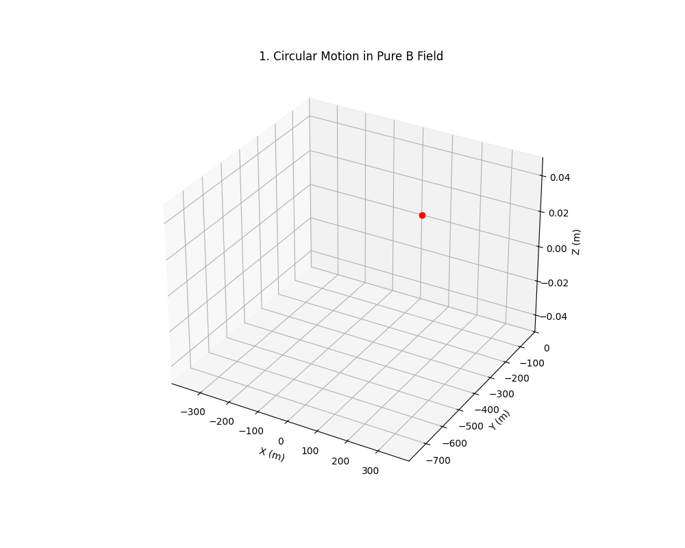
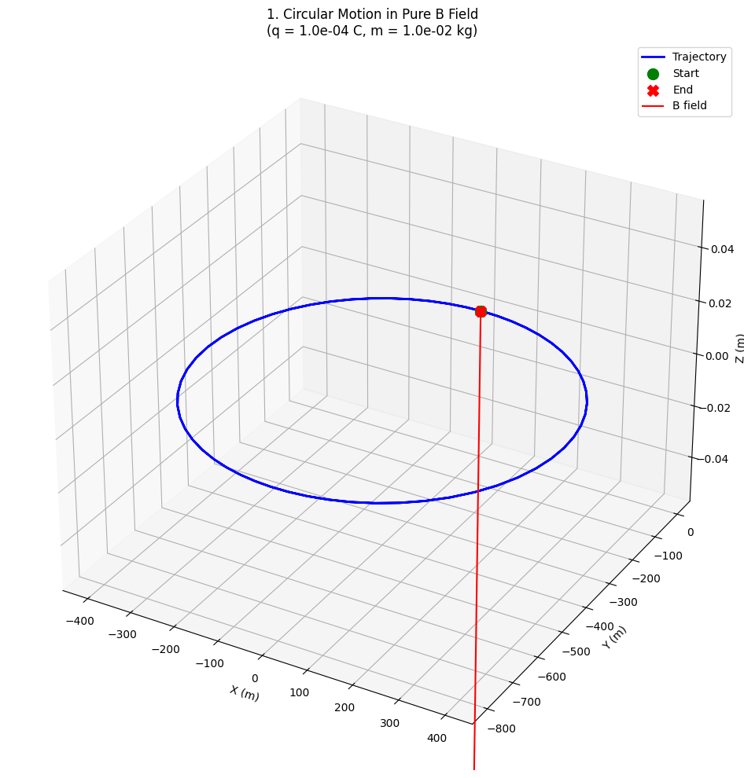
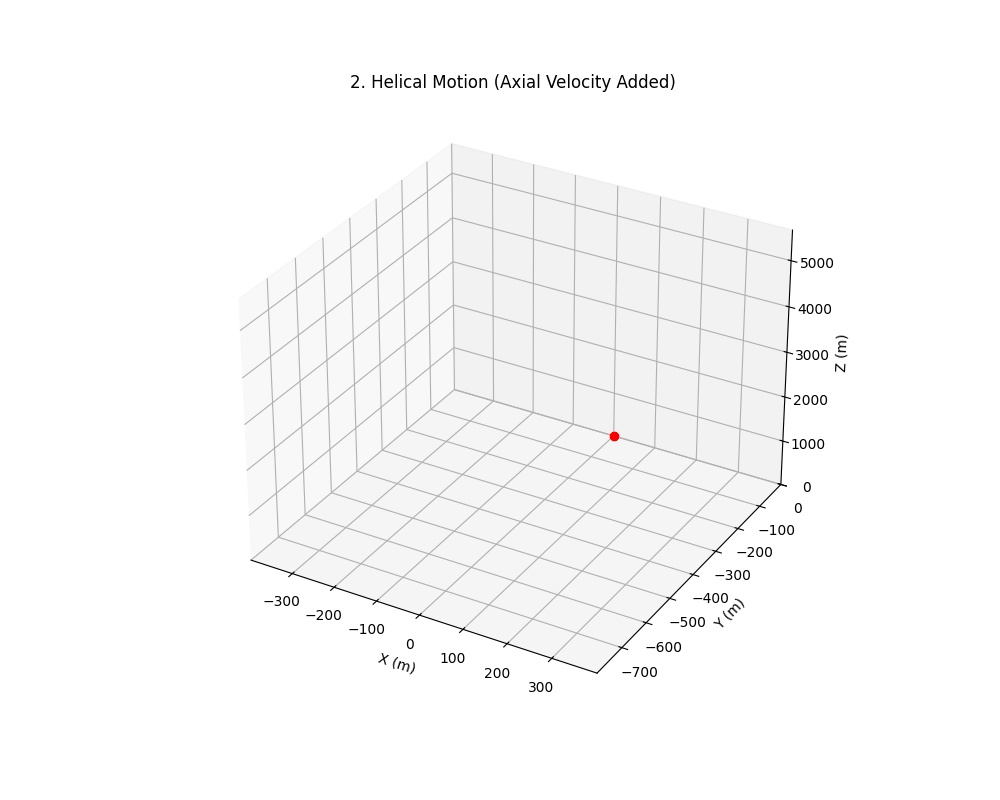
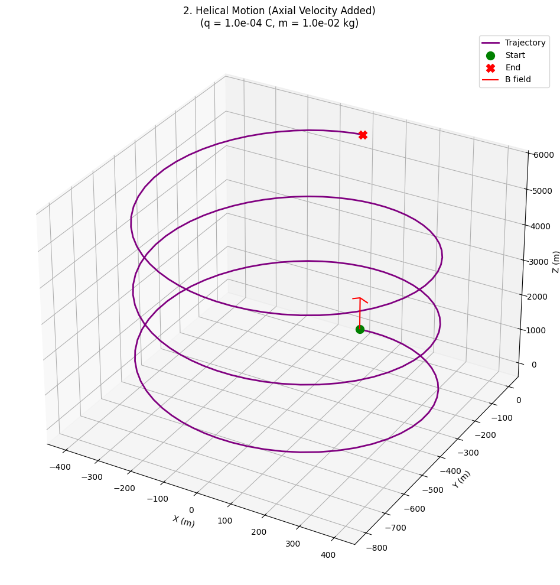
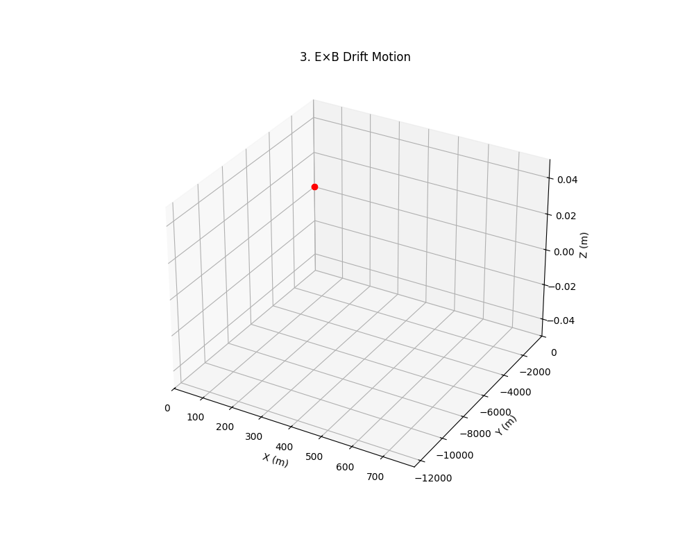
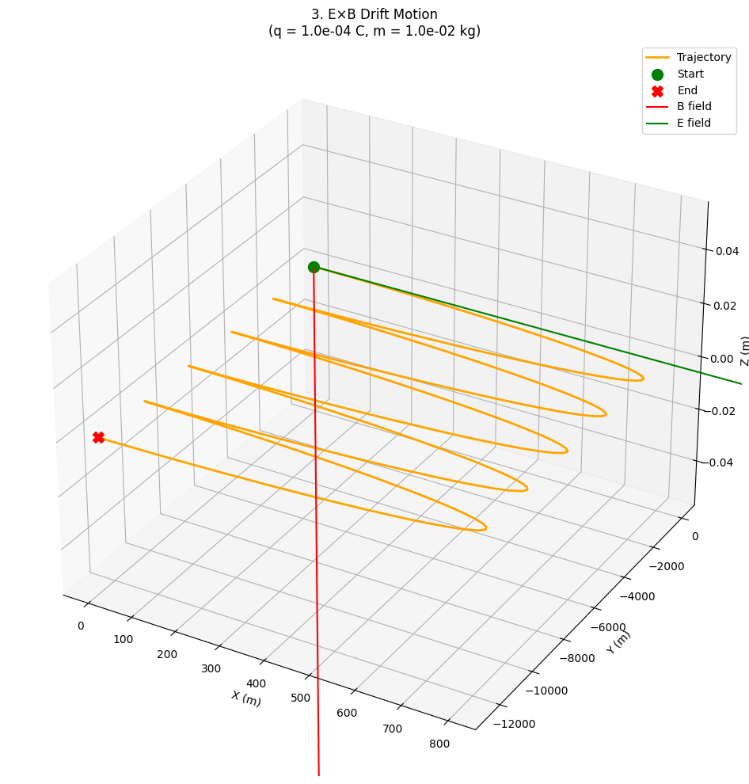

# Problem 1

#  Lorentz Force — Simulation & Theory

## Introduction

The **Lorentz Force** is the fundamental force experienced by a charged particle in electric and magnetic fields:

$$
\mathbf{F} = q\mathbf{E} + q\mathbf{v} \times \mathbf{B}
$$

Where:

- $q$: charge (Coulombs)

- $\mathbf{E}$: electric field (V/m)

- $\mathbf{v}$: velocity vector (m/s)

- $\mathbf{B}$: magnetic field (Tesla)

> **Important:** In this project, we simulate a macroscopic particle with  
> $q = 1~\text{C}$ and $m = 1~\text{g} = 10^{-3}~\text{kg}$  
> instead of tiny electron values to ensure visible and meaningful trajectories.

---

##  Useful Concepts & Formulas

### 1. Magnetic Force Only (no electric field)
$$
\mathbf{F} = q\mathbf{v} \times \mathbf{B}
$$
- Direction: Perpendicular to both $\mathbf{v}$ and $\mathbf{B}$
- Result: **Circular** or **helical** motion

### 2. Larmor Radius
$$
r_L = \frac{mv_\perp}{|q|B}
$$

### 3. Cyclotron Frequency
$$
\omega_c = \frac{|q|B}{m}
$$

### 4. E × B Drift Velocity
$$
\mathbf{v}_d = \frac{\mathbf{E} \times \mathbf{B}}{B^2}
$$

---

# Charged Particle Motion in Electromagnetic Fields

## Scenario 1: Circular Motion (Pure B Field)

### Physical Setup
- **Fields**: 
  - Magnetic: $\vec{B} = (0, 0, 0.5)$ T (z-direction)
  - Electric: $\vec{E} = \vec{0}$
- **Initial Conditions**: 
  - Position: $\vec{r}_0 = (0, 0, 0)$ m
  - Velocity: $\vec{v}_0 = (2.0, 0, 0)$ m/s (perpendicular to B)

### Theory

The particle executes circular motion with:

- Cyclotron radius:  
  $$
  r = \frac{mv_\perp}{qB} = \frac{0.01 \times 2.0}{10^{-4} \times 0.5} = 0.4 \text{ m}
  $$

- Cyclotron period:  
  $$
  T = \frac{2\pi m}{qB} \approx 1.26 \text{ s}
  $$

### Key Characteristics
1. Planar motion in x-y plane
2. Constant speed $v_\perp = 2.0$ m/s
3. Radius matches theoretical prediction:

---

## Scenario 2: Helical Motion (Added Axial Velocity)

### Physical Setup
- **Fields**: Same as Scenario 1
- **Initial Conditions**: 
  - $\vec{v}_0 = (2.0, 0, 1.5)$ m/s (added z-component)

### Theory

Superposition of:

1. Circular motion in x-y plane  

   ($v_\perp = 2.0$ m/s)

2. Uniform motion along z-axis  

   ($v_\parallel = 1.5$ m/s)

Pitch distance:

$$
p = v_\parallel \cdot T \approx 1.5 \times 1.26 \approx 1.89\ \text{m}
$$

---

## Scenario 3: E×B Drift (Crossed Fields)

### Physical Setup
- **Fields**:
  - $\vec{E} = (1.0, 0, 0)$ V/m
  - $\vec{B} = (0, 0, 0.5)$ T
- **Initial Conditions**: $\vec{v}_0 = \vec{0}$

### Theory

Drift velocity given by:

### Theory

The **E × B drift velocity** is given by:

$$
\vec{v}_E = \frac{\vec{E} \times \vec{B}}{B^2}
= \frac{(1.0\,\hat{i}) \times (0.5\,\hat{k})}{(0.5)^2}
= \frac{0.5\,\hat{j}}{0.25}
= 2.0\,\hat{j} \text{ m/s}
$$

Thus,

$$
\vec{v}_E = (0, 2.0, 0)\ \text{m/s}
$$

Expected trajectory:
1. Initial acceleration in x-direction
2. Curved transition phase
3. Steady drift in y-direction

## Comparative Analysis

| Scenario        | Field Configuration | Motion Type | Characteristic Velocity |
|----------------|--------------------|------------|------------------------|
| Circular       | Pure B             | Planar     | $v_\perp$ only         |
| Helical        | Pure B             | 3D spiral  | $v_\perp + v_\parallel$|
| E×B Drift      | Crossed E and B     | Curved drift | $v_E = E/B$          |

## Scenario 1: Circular Motion (Pure B Field)

 | |
  |:-------------------------:|:-------------------------:|

## Scenario 2: Helical Motion (Added Axial Velocity)

 |   |
  |:-------------------------:|:-------------------------:|

## Scenario 3: E×B Drift (Crossed Fields)

 |   |
  |:-------------------------:|:-------------------------:|

Visualizations for each are in the [Google Colab](https://colab.research.google.com/drive/1xKfLyHu_g3Ok0v1teVgerG4qRpZNWKgG?authuser=1#scrollTo=dZHomL-rZeLJ).
