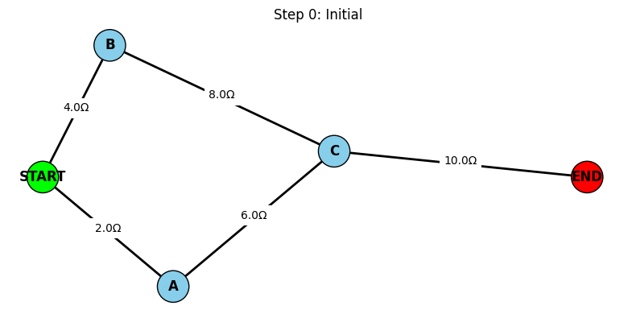
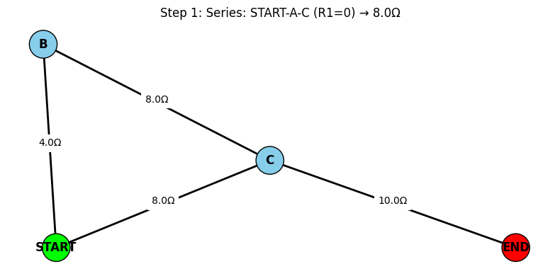
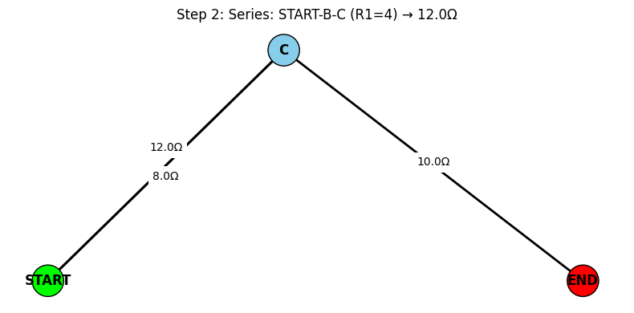
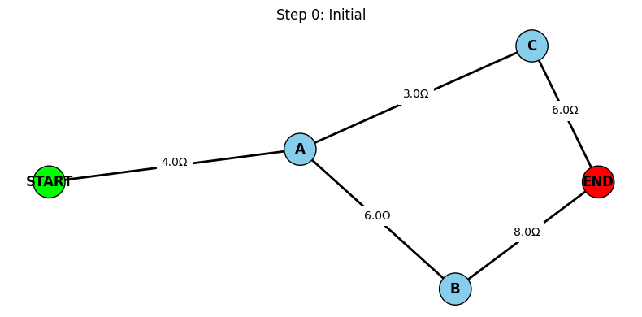
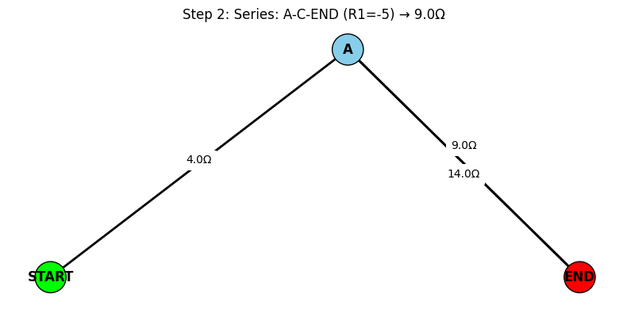
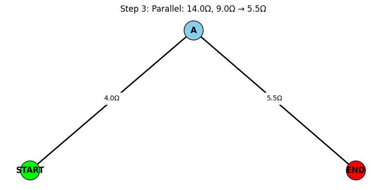

# Problem 1

#  Equivalent Resistance Using Graph Theory

## Motivation

Calculating equivalent resistance is a fundamental task in analyzing electrical circuits. Traditional methods rely on applying series and parallel rules repeatedly, which becomes cumbersome for complex networks.

**Graph theory** provides a structured and scalable approach by modeling circuits as graphs:
- **Nodes** = Junctions
- **Edges** = Resistors, with weights equal to resistance values

This method is not only systematic but also useful for automation and simulations in engineering and computer science.

---

##  Definitions

- **Graph**: A collection of nodes (vertices) and edges (connections), where edges can carry weights.
- **Series Connection**: Resistors connected end-to-end. The same current flows through each.
- **Parallel Connection**: Resistors connected across the same two nodes. Voltage across each is the same.
- **Equivalent Resistance ($R_{\text{eq}}$)**: The single resistance that can replace a network of resistors between two terminals.

---

##  Formulas

- **Ohm’s Law**:  
  $$ V = IR $$

- **Resistors in Series**:  
  $$ R_{\text{eq}} = R_1 + R_2 + \cdots + R_n $$

- **Resistors in Parallel**:  
  $$ \frac{1}{R_{\text{eq}}} = \frac{1}{R_1} + \frac{1}{R_2} + \cdots + \frac{1}{R_n} $$

---

##  Algorithm Using Graph Theory

###  Goal

Reduce a resistor network to a single equivalent resistance between two terminals using graph-based simplification.

###  Algorithm Steps

1. **Graph Representation**:
   - Each junction is a node.
   - Each resistor is an edge with a weight (resistance).

2. **Iterative Simplification**:
   - Detect linear chains and apply series reduction.
   - Detect cycles/branches and apply parallel reduction.

3. **Repeat Until**:
   - The graph is reduced to two nodes (terminals), and one edge (final resistance).

---

## Example 1: Bridge Circuit

 | |
  |:-------------------------:|:-------------------------:|
 | 

## Example 2:  Series-Parallel Circuit

 | |
  |:-------------------------:|:-------------------------:|
 |

 | |
  |:-------------------------:|:-------------------------:|

##  Efficiency & Improvements

* For arbitrary graphs, use DFS/BFS to detect cycles and paths.
* Edge contractions and custom graph traversal rules improve performance.
* Replace rule-based detection with symbolic solvers or matrix-based solvers for large circuits.

 [Google Colab](https://colab.research.google.com/drive/1obDQDzBjN9ApNuOBuXs4oTD1PMvoBug0?usp=sharing)