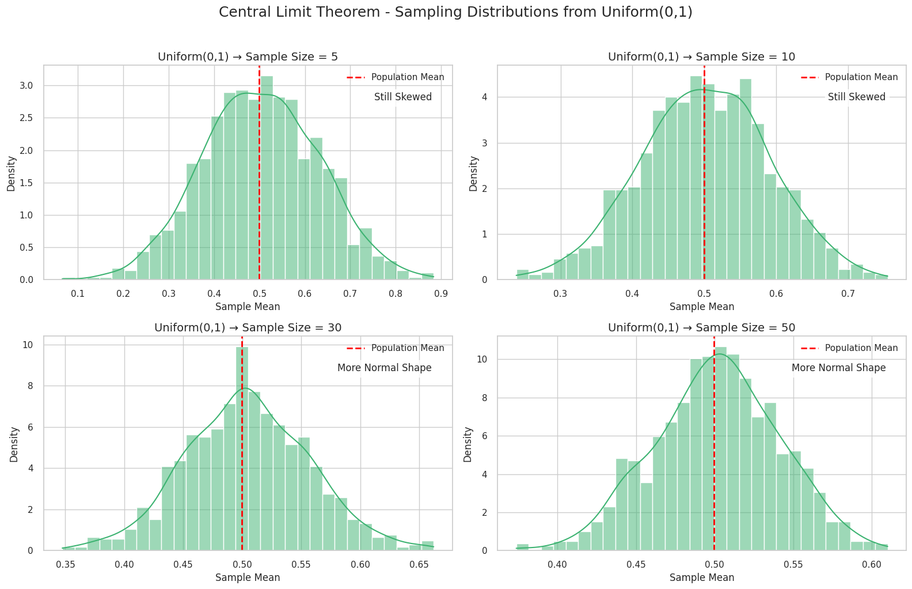
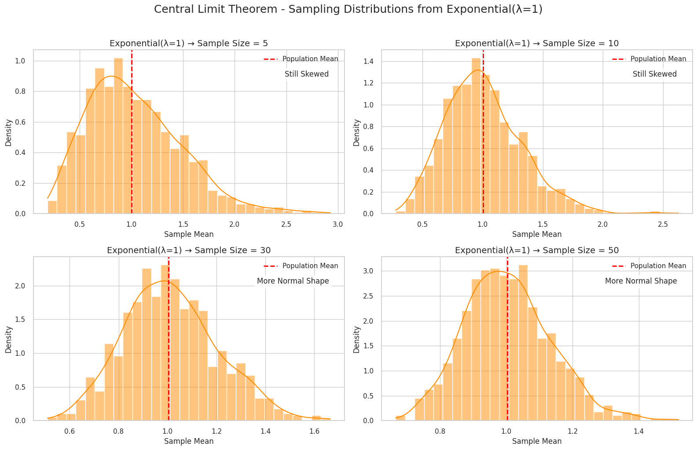

# Problem 1

#  Central Limit Theorem: Exploring Through Simulations

---
##  Theoretical Background

### Central Limit Theorem Definition

 The Central Limit Theorem is a fundamental concept in probability and statistics. It states that:  
 
The **sampling distribution** of the **sample mean** approaches a **normal distribution** as the **sample size** increases, regardless of the shape of the population distribution.

### Formal Statement

Let $X_1, X_2, \ldots, X_n$ be independent and identically distributed random variables with:

- Population mean: $\mu$
- Population variance: $\sigma^2$ (finite)

Then, as $n \to \infty$, the standardized sample mean converges in distribution to a standard normal distribution:

$$
\frac{\bar{X}_n - \mu}{\sigma/\sqrt{n}} \xrightarrow{d} N(0,1)
$$

where:

$$
\bar{X}_n = \frac{1}{n}\sum_{i=1}^{n} X_i
$$

---

##  Mathematical Definitions

### Sample Mean

$$
\bar{X}_n = \frac{1}{n}\sum_{i=1}^{n} X_i
$$

### Sample Variance

$$
S^2 = \frac{1}{n-1}\sum_{i=1}^{n}(X_i - \bar{X})^2
$$

### Standard Error of the Mean

$$
SE(\bar{X}) = \frac{\sigma}{\sqrt{n}}
$$

### Z-Score for Sample Mean

$$
Z = \frac{\bar{X} - \mu}{\sigma/\sqrt{n}}
$$

---

##  Key Formulas

### 1. Uniform Distribution

- PDF: $f(x) = \frac{1}{b-a}$ for $a \leq x \leq b$  
- Mean: $\mu = \frac{a+b}{2}$  
- Variance: $\sigma^2 = \frac{(b-a)^2}{12}$

### 2. Exponential Distribution

- PDF: $f(x) = \lambda e^{-\lambda x}$ for $x \geq 0$  
- Mean: $\mu = \frac{1}{\lambda}$  
- Variance: $\sigma^2 = \frac{1}{\lambda^2}$

### 3. Binomial Distribution

- PMF: $P(X = k) = \binom{n}{k}p^k(1-p)^{n-k}$  
- Mean: $\mu = np$  
- Variance: $\sigma^2 = np(1-p)$

### Convergence Properties

As sample size $n$ increases:

- Mean of sampling distribution: $E[\bar{X}] = \mu$  
- Variance of sampling distribution: $Var[\bar{X}] = \frac{\sigma^2}{n}$  
- Standard deviation: $SD[\bar{X}] = \frac{\sigma}{\sqrt{n}}$

---

##  Visualizations

##  Understanding the Central Limit Theorem (CLT) from the Visualizations

###  Setup Summary:
We simulate sampling distributions of the **sample mean** using:

- **Three population types**:
  - **Uniform(0, 1)** — a flat, symmetric distribution.
  - **Exponential(λ = 1)** — a right-skewed distribution.
  - **Binomial(n = 10, p = 0.3)** — a discrete, slightly left-skewed distribution.
- Each population consists of **100,000 values**.
- From each population, we draw **1,000 random samples** at each of the following sample sizes:
  - `n = 5`, `n = 10`, `n = 30`, and `n = 50`.
- We calculate the **mean** of each sample and visualize the distribution of these sample means using histograms.

---

###  What the Visualizations Show:

1. **Shape Convergence**:
   - As the sample size **increases**, the distribution of sample means becomes increasingly **bell-shaped and symmetric**.
   - This happens even when the original population is **skewed** (e.g., Exponential).

2. **Centering Around the Population Mean**:
   - The **red dashed line** in each plot shows the **true population mean (μ)**.
   - Regardless of the population shape, the **sampling distributions center** around this true mean.

3. **Spread Decreases with Larger Samples**:
   - With larger sample sizes, the sample means **cluster more tightly** around the population mean.
   - This reflects the decrease in **standard error**:  
     $$
     \text{Standard Error} = \frac{\sigma}{\sqrt{n}}
     $$

---

###  Key Takeaways:

 The **Central Limit Theorem** guarantees that:
- The **distribution of sample means** will approach a **normal distribution** as the sample size increases — **regardless of the population's shape**.
- The sample mean is an **unbiased estimator** of the population mean.

 Even if the original population is **skewed or discrete**, the **sampling distribution of the mean** becomes more **normal and centered** as `n` increases.

 **Real-world importance**:
- In practice, this means that we can apply normal-based inference (confidence intervals, hypothesis tests) to sample means, even when the population isn't normal — **as long as the sample size is large enough**.

---
 [Google Colab](https://colab.research.google.com/drive/1OMtNuOz3oFZAc3aPjXNYmsn3IxbSf50G?usp=sharing)

