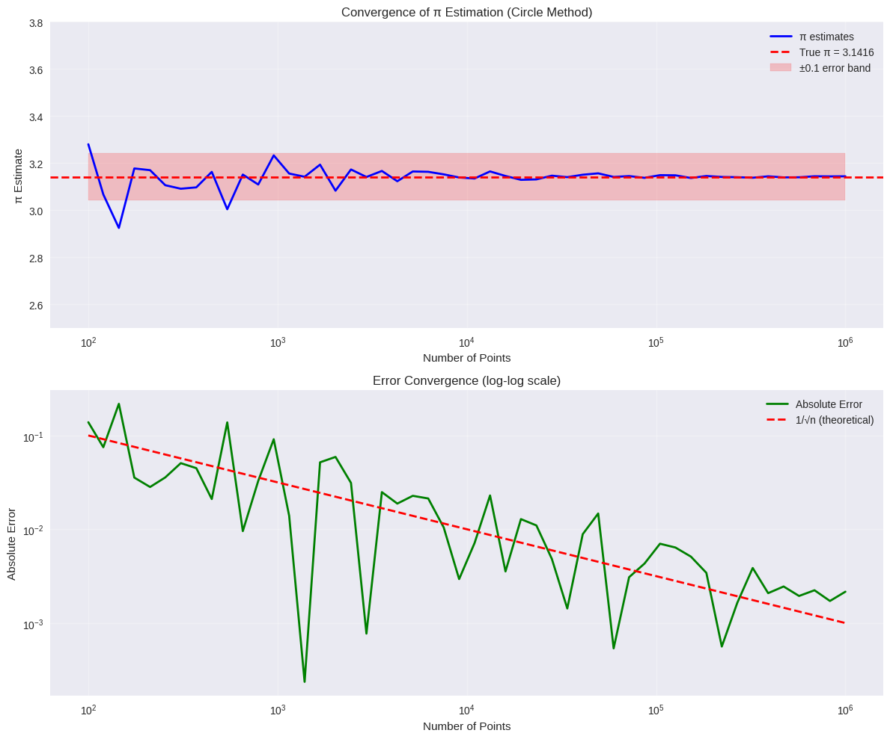
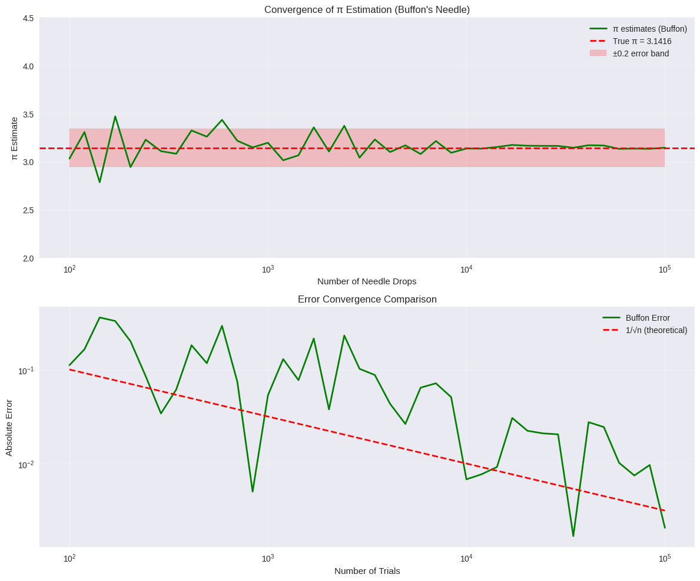
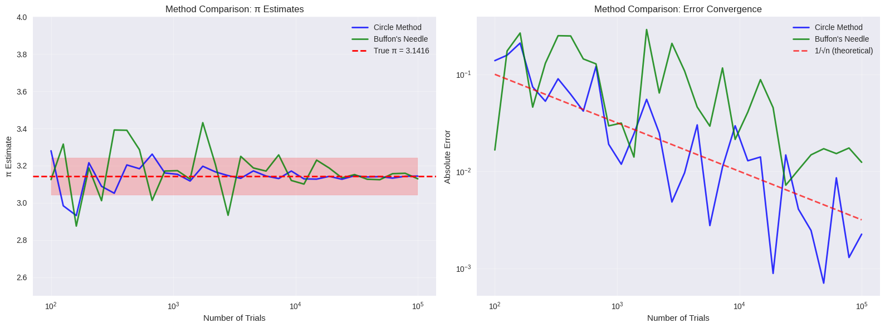

# Problem 2

#  Estimating $\pi$ Using Monte Carlo Methods

##  Objective

Estimate the value of $\pi$ using two classic Monte Carlo methods:
1. Circle-based random point simulation.
2. Buffon’s Needle experiment.

This document explains the theory, implements simulations in Python, provides visualizations, and analyzes convergence.

---

##  Part 1: Circle-Based Monte Carlo Estimation

###  Theoretical Foundation

We generate random points in a square and count how many fall inside a circle.

- For a **unit circle** of radius \( r = 1 \), the **area** is:

$$
A_{\text{circle}} = \pi r^2 = \pi
$$

- The square enclosing the unit circle (from \((-1, -1)\) to \((1, 1)\)) has area:

$$
A_{\text{square}} = (2r)^2 = 4
$$

- The **ratio** of points inside the circle to the total number of points approximates the ratio of their areas:

$$
\frac{\text{Points inside circle}}{\text{Total points}} \approx \frac{\pi}{4}
$$

Thus, we estimate:

$$
\pi \approx 4 \cdot \frac{\text{Points inside circle}}{\text{Total points}}
$$

---

###  Observations

- Accuracy increases with larger sample size.
- Method is simple, visual, and intuitive.
- Convergence is slow: many points are needed for high precision.

---

## 🪡 Part 2: Buffon’s Needle Method

### 🎓 Theoretical Foundation

Drop a needle of length $L$ onto a floor with parallel lines spaced $d$ units apart.

- If $L \leq d$, the probability of the needle crossing a line is:

$$
P = \frac{2L}{d \pi}
$$

Rearranging the probability formula gives:

$$
\pi \approx \frac{2 L \cdot N}{d \cdot C}
$$

Where:  
- $N$ = total number of drops  
- $C$ = number of times the needle crosses a line  

---
### Circle Method - Point Distribution:
.gif>)

### Buffon's Needle - Convergence Analysis:

### Method Comparison:

---

###  Convergence and Comments

- Slower convergence than the circle method.
- Larger variance due to probabilistic condition.
- Computationally interesting but not as efficient for π estimation.

---

## Comparison Summary

| Method           | Formula                                         | Convergence | Visual Appeal | Accuracy (modest N) |
|------------------|-------------------------------------------------|-------------|----------------|----------------------|
| Circle Method     | $\pi \approx 4 \cdot \frac{M}{N}$              | Faster      | High           | Good                 |
| Buffon’s Needle   | $\pi \approx \frac{2L \cdot N}{d \cdot C}$     | Slower      | Medium         | Noisy estimates      |

---

## Conclusion

Monte Carlo methods elegantly demonstrate the power of randomness in numerical computation. Both approaches estimate π using probabilistic geometry. The circle-based method is faster and more reliable, while Buffon’s needle is historically rich and conceptually unique.

---
 [Google Colab](https://colab.research.google.com/drive/1he_V67JIMCwsvfEs5QM3-73DwOQDepod?usp=sharing)